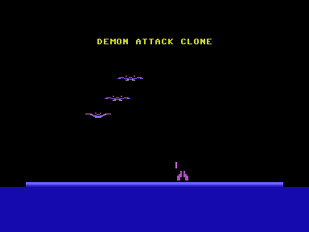
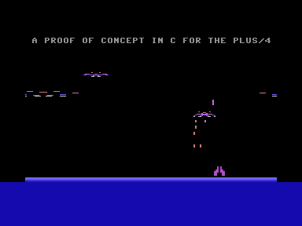
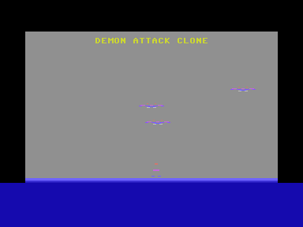
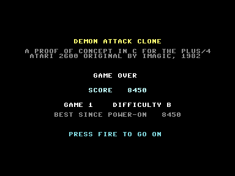
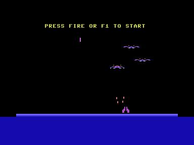

# Demon Attack Clone for the Commodore Plus/4

A clone of **Demon Attack** for the Atari 2600 (Imagic, 1982). All ten game
variants, one or two players, the splitting demons, the small ones that
dive at the cannon, both difficulty switches, and the original's sounds.

This repository also has a [Phoenix clone](../phoenix/README.md): the
Atari 2600 Phoenix on the Plus/4, built from measurements of the original,
with some parts still reconstructed. This clone behaves like the original frame for
frame: the same rules, speeds, patterns and sounds. That is checked
automatically against the original running in an emulator. Getting there
meant solving problems the Phoenix clone could avoid, and those solutions are what
this README is mostly about.



**Controls**

| | |
| --- | --- |
| Joystick in port 1 (player 1) or port 2 (player 2) | left/right to move, button to fire |
| Keyboard | cursor left/right, `Space` to fire, for whichever player's turn it is |
| `F1` | the 2600's *Game Reset* switch: start a game |
| `F2` | *Game Select*: step through the ten variants |
| `F3` / `Help` | the left / right *difficulty* switch, A or B |
| `Run/Stop` | leave (cold start) |

In the demo, pressing fire starts a game too.

## The ten games

| Game | |
| --- | --- |
| 1 | one player |
| 2 | two players, taking turns |
| 3, 4 | as 1 and 2, with **tracer shots**: the shot follows the cannon left and right on its way up |
| 5–8 | as 1–4, starting at a later, harder wave |
| 9 | two players at **one cannon**, control changing hands every few seconds |
| 10 | as 9, with tracer shots |

The difficulty switch changes one thing. On **A**, a demon deciding where to
go always knows which side of it the cannon is on. On **B** it gets that
wrong half the time when the two are close.




## The hall of fame page

When a game ends, the game stops on a still page before it goes back to the
demo. The page shows what a photo needs in order to count as proof of a
score:

- the game's name and the original's maker;
- the score, or both scores in a two-player game;
- the variant and the difficulty it was played at;
- the best score since the machine was switched on.

Fire, `Space` or `F1` goes on into the demo, at the point where the
original would be.



The page is honest, not tamper-proof: anyone with an emulator's monitor can
set a score.

The original's demo shows the IMAGIC logo at the top. The logo is not a
picture of its own: at power-on the game sets player 1's score to the
"digits" AB CD EA, whose shapes spell IMAGIC. That score is left alone in
memory here, and only the drawing shows something else in its place. Four
lines take turns there: the name, the original's maker, what this is, and
how to start. After a game, the last score takes a turn as well. All text
uses the Plus/4's own character ROM. The demo lines copy their letters out
of it once at start-up, and the page shows the ROM character set directly.



## What is new compared with the Phoenix clone

The Phoenix clone gets around the missing sprites with finished blocks of
characters, one colour per cell, and speeds counted in clock ticks. It
accepts the limits of all three, and its README lists them. Demon Attack
does not allow that:

- every line of a demon has its own colour;
- whether a shot hits is decided pixel by pixel, the way the 2600's video
  chip sees it;
- the timing has to be the original's exactly, or the game cannot be
  compared with the original.

### A colour on every line

A TED character cell has four colours, and two of them come from registers
that apply to the whole screen. So a raster interrupt changes those two
registers while the picture is being shown. Each picture carries a list of
register writes, each tied to a raster line, and the interrupt works
through it.

The trick that makes one write per line enough is alternating. A demon's
odd lines use one register and its even lines the other. So each register
can be changed during the line where only the other one is on screen,
without any race against the beam. The interrupt is requested two lines
ahead, because getting into the handler takes more than a line, and then it
waits for its line.

One line in eight defeats this. On the first line of every character row the
TED fetches the row's codes and holds the CPU until late in the line, so a
register write there comes too late. Those lines take their colour from the
colour cells instead, the third colour a multicolour cell has. Every
character therefore has a fixed pattern of which bit pairs each line may
use: `%11` on line 0, `%01` on odd lines, `%10` on even ones. A demon is
drawn through that mask. The ground's colour gradient uses the same list.

The price is about 15 % of the CPU: through each demon's band the interrupt
waits from one write to the next.

### Two complete screens

There are two character sets and two screens, at `$C000`–`$DFFF`. The game
draws into the hidden one, and the interrupt swaps them at the bottom of the
picture once it is finished, so nothing is ever seen half-drawn. Every
list below exists once per screen.

### Characters handed out per picture

The Phoenix clone gives each figure a fixed block of characters. Here the characters
are pooled instead:

- **Short-lived figures** (shots, the cannon's laser, debris) get characters
  from a pool of 134, handed out afresh for every picture. Every cell handed
  out is noted together with what it held before, and the next picture drawn
  into that screen puts all of them back first.
- **Fixed characters** (the cannon, the ground with its bunkers, the score)
  are copied before anything is drawn into them. A shot passing the cannon
  then changes a copy, and the cannon's own character stays whole.
- **The three demon slots** keep ten characters each, per screen, from one
  picture to the next. When a demon moves, only the lines that changed are
  written, not all 80 bytes.
- **Where two figures meet** in one cell, the later one is ORed into the
  earlier one's character. That character is then marked, and the next time
  it is drawn it is rewritten in full, so no pixels are left behind.

Unlike in the Phoenix clone, two large figures can sit on each other for as long as
they like.

### Collisions from the picture, not from boxes

The 2600 knows about collisions only because its video chip reports them
while it draws. [kernel.s](kernel.s) replays the lines the 2600 would draw
and works out which pixels would be lit. It includes the chip's timing
quirks: a register written in the middle of a line only takes effect from a
certain pixel on, and left of it the line keeps the old shape. Wherever two
objects' pixels meet, it sets the same collision latches the chip has, and
the game reads them as it would on the 2600. The drawing then uses what this
replay worked out.

### A fixed frame rate that catches up

The Phoenix clone counts every speed in ticks of the KERNAL clock, with the remainder
of a pixel carried over, so it runs at the right speed however long drawing
takes. That is not possible here, because the logic has to advance in the
original's frames and nothing else. So:

- The cartridge is the American one and runs **sixty frames a second**. The
  Plus/4 shows fifty pictures, so five pictures owe the game six frames.
- Every picture that goes by adds six fifths of a frame. All the frames owed
  are worked out, collisions included, and only the last of them is drawn.
- A frame that is not drawn costs about a third as much as a drawn one,
  because only the collision part of the kernel runs.

The game therefore always runs at exactly the original's speed, and the
sound comes out at the original's tempo with it. Sound needs no interrupt of
its own this time: the two 2600 voices are translated onto the TED's two
once per frame, with noise always going to voice 2, the only one that can
make it.

### Checked frame for frame

Because the timing is exact, the clone can be compared with the original
directly:

1. The original runs in Stella (driven headless as described in
   [the Phoenix clone's README](../phoenix/README.md#measuring-the-original)) and is
   stopped somewhere in a game.
2. Its 128 bytes of RAM are poked into a debug build of this clone running
   in VICE (`DEBUG=1 ./build.sh`).
3. Both run on for the same number of frames, and the two RAM images are
   compared.

After 3000 frames of the demo and 1000 frames of a game there is **not one
byte of difference**, apart from a few bytes the 2600 uses as scratch
space while it draws. The check was run again after every change.

### Measuring where the cycles go

The Phoenix clone was tuned by counting passes per second. Here each part of a frame
is timed on its own:

- **Plain cycle counts.** The debug build can stop at any frame. It then
  switches off the interrupt and the screen, so the TED gives the CPU full
  speed throughout and nothing interrupts it. It runs the frame's parts one
  by one, each from the same state, and VICE's cycle counter at marker
  functions gives what each part costs, in plain cycles.
- **Instruction-level profiles.** VICE's CPU history (`chis`) records every
  instruction with its cycle count. Grouped by routine, and down to single
  lines of the assembly source, it shows where the time goes.

This is what found, for example:

- the position stepping in the C logic, which is now a table;
- the demons' lasers, which went through the general drawing path and now
  have a direct one;
- the fact that the joystick was read for every frame caught up, not once
  per picture.

The numbers as they stand:

| | cycles |
| --- | --- |
| left to the program per picture (display on, interrupt running) | about 20,700 |
| a frame that is drawn | about 31,000 |
| a frame that is only worked out | 8,000–10,000 |

That makes about two pictures in five drawn.

## What is not 1:1

- **Not every frame is drawn**, only about two in five. Movement is coarser
  than on the 2600, but never slower.
- **Sixty frames on fifty pictures.** Even with every picture drawn, every
  fifth picture would move two frames on. This is the small judder every
  NTSC game has on a PAL machine.
- **Colours** are the nearest the TED has to the 2600's NTSC palette.
- **The IMAGIC logo** gives way to the lines described above, and the page
  at the end of a game is new.

## Files

| | |
| --- | --- |
| [demonattack.c](demonattack.c) | the game logic, sound, input, the demo's lines and the end-of-game page, start-up and the main loop |
| [kernel.s](kernel.s) | the 2600 kernel replayed: what each line shows, the collisions, the drawing calls |
| [engine.s](engine.s) | the Plus/4 side: raster interrupt, the two screens, the character pool and the drawing routines |
| [demonattack.cfg](demonattack.cfg) | memory layout: the 2600's RAM in zero page at `$80`–`$FF`, program to `$B7FF`, the end-of-game page at `$B800`, the two screens at `$C000`–`$DFFF` |
| [build.sh](build.sh) | builds `build/demonattack.prg`; with `DEBUG=1` also the test build `build/dbg.prg` |

## Building and running

From the repository root, with `demonattack.c` active in the editor, `F5`
builds and starts it. Unlike the other programs, this one is three sources
and a linker configuration, so the root's run script hands the build to
[build.sh](build.sh). Without an editor:

```sh
./build.sh
~/.local/share/cc65-vs64/bin/xplus4 -autostartprgmode 1 build/demonattack.prg
```

`build.sh` looks for cc65 in `~/.local/share/cc65-vs64/bin`, or in
`CC65_BIN` if that is set. As for the Phoenix clone, `-Cl` is on.
