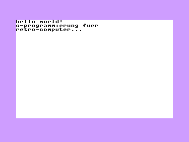

# main — the starting point

The smallest program that proves the toolchain is wired up correctly: it
clears the screen, prints a couple of lines through `conio` and waits for a
key. Nothing here is interesting except that it works — which is exactly what
it is for.



Use it as the template for a new program. The three files in `.vscode/` are
deliberately program-agnostic (they go through `${workspaceFolderBasename}`),
so they can be copied unchanged; see *Adding a program* in the
[repository README](../README.md).

## Building and running

From the repository root, with `main.c` active in the editor, `F5` builds and
starts it. Without an editor:

```sh
BIN=~/.local/share/cc65-vs64/bin
mkdir -p main/build
$BIN/cl65 -t plus4 -O -g -c -o main/build/main.o main/main.c
$BIN/cl65 -t plus4    -o main/build/main.prg main/build/main.o
$BIN/xplus4 -autostartprgmode 1 main/build/main.prg
```

Opening this folder in VS Code instead of the repository root gives `F5` the
VS64 debugger with source-level breakpoints.
