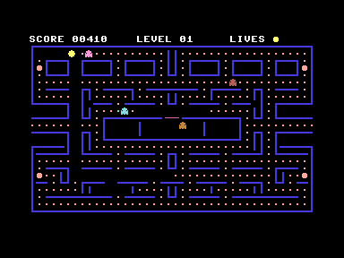
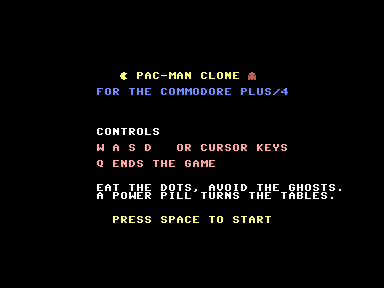

# Pac-Man for the Commodore Plus/4

A complete Pac-Man: the full 40×24 maze on screen at once, four ghosts with
their own ways of hunting, power pills, levels, lives and TED sound. About
1500 lines of C and two routines in assembly.




**Controls:** joystick in port 1, or `W A S D`, or the cursor keys — all
three at the same time. Fire starts the game, `Q` ends it.

## Reading the joystick

Worth knowing before touching the input code, because it is easy to get
almost right. The keyboard and both joysticks hang on the same eight lines,
fed by two latches: `$FD30` (the 6529B) takes the keyboard row, `$FF08` is
the TED's own. Writing a value with bit 2 low to `$FF08` puts joystick 1 on
those lines instead of a keyboard row, and `$FF` in `$FD30` keeps every key
out of the answer. A zero bit is a closed contact — 0 up, 1 down, 2 left,
3 right, 6 fire.

And `$FF08` has to be read **twice**. The write leaves its own value on the
data bus and the TED samples the lines a cycle later, so a read in the very
next instruction hands back what was just written, which looks exactly like
the contact on that line being closed. The second read gets the real sample.
A test program misses this easily: as soon as a couple of instructions
happen to sit between the write and the read, the answer is right by
accident.

BASIC's own `JOY()` at `$BFC0` selects with `$FA` rather than `$FB`, and
reads in a loop until two reads agree. Both selects work — only bit 2
decides — and both were measured on the machine rather than read off a
manual.

The sharing cuts the other way too, and that one bit players. Joystick 1
sits on the lines of keyboard row `$FB`, and to the KERNAL's own scan its
contacts are simply keys. Read out of the ROM table at `$E026`, that row is

| bit | 0 | 1 | 2 | 3 | 4 | 5 | 6 | 7 |
|---|---|---|---|---|---|---|---|---|
| key | 5 | R | **D** | 6 | C | F | T | X |

so pushing the stick left *is* the key `D` — which is this game's key for
right. While the stick was held the joystick read came last and won, but the
`D`s piled up in the KERNAL's buffer, and the moment the player let go, one
of them turned Pac-Man round. Only that one direction can do it: up, down,
right and fire land on `5`, `R`, `6` and `T`, none of which the game uses.
The game therefore throws the keyboard buffer away while the stick is off
centre.

One thing about the emulator rather than the machine: **VICE looks for
joysticks only at startup** and only in `/dev/input/by-id`. A wireless pad
that is asleep when VICE starts, or connects afterwards, is not picked up at
all.

## How the figures are made

The Plus/4 has no sprites. Every figure is built from characters that are
recomputed on every frame — which is what lets them move pixel by pixel
instead of tile by tile, and lets them be larger than a tile.

- Bit 7 of `$FF07` switches off the TED's habit of showing codes 128–255 as
  inverted copies of 0–127. All 256 characters are then free, and the upper
  128 serve as a pool: each figure claims a few of them, has its picture
  written into them on every frame, and places them on the screen.
- The figure bitmaps are kept horizontally pre-shifted in RAM, so per frame it
  is only a merge of figure over maze background, not a shift.
- The maze walls are drawn as the outline of each wall area, as a stroke two
  pixels thick inset three pixels from the tile edge. Inset and thickness are
  chosen so that the strokes of opposite edges fall on top of each other: a
  wall one tile thick then looks exactly like the outline of a large block.

[pacman.c](pacman.c) is commented throughout and is meant to be read top to
bottom: hardware, character set, maze, sound and input, figures, drawing,
movement and ghost AI, game flow.

## The ghosts

Each of the four picks its target tile differently, and then simply takes the
step that shortens the straight line to it — the same rule the arcade machine
uses.

- **Blinky** heads straight for Pac-Man, and speeds up as the maze empties.
- **Pinky** aims four tiles ahead of Pac-Man, so it tends to cut him off.
- **Inky** takes the point two tiles ahead of Pac-Man and mirrors Blinky
  through it, which makes it the least predictable of the four.
- **Clyde** chases while it is far away and breaks for its corner once it
  gets within eight tiles.

They alternate between a few seconds of heading for their own corners and a
long stretch of hunting, and they leave the house as the dots disappear
rather than all at once. Each has its own base speed.

Eaten ghosts are the one exception: they walk home along a distance field
laid down once per level by breadth-first search. The hunting rule cannot be
used for that — in a maze with loops "always shorten the straight line, never
turn back" can cycle forever, and a pair of eyes then circles the level
instead of going home.

## What was learned the hard way

- **Figure size costs more than it looks.** A figure wider than a tile does
  not cost proportionally more but quadratically: 1×2 cells become 3×3.
  Bringing the figures down from 10×10 to 8×8 pixels was the single biggest
  speed-up of the whole exercise — bigger than anything possible inside the
  drawing loop.
- **`memcpy`/`memset` are expensive for small blocks.** Under cc65 they cost
  around 700 cycles per call for 16 to 24 bytes, and there were thirty calls
  per frame. Written out by hand the same work costs a fraction.
- **Casting the cell loop into assembly gained nothing.** The measurable wins
  came from removing `%` and 16-bit multiplications from the C loops, from
  precomputed row starts, and from skipping work that was not needed.
- **Eat the tile before testing the wall.** Pac-Man ate what he stood on
  only after checking that he could carry on, so a tile he stopped dead on
  stayed uneaten until he turned. Two of the four power pills sit in an
  L-corner, where that is exactly what happens — players saw the pill "take
  effect one dot later".
- **cc65 misreads deeply nested conditional expressions.** `a ? b : c ? d : e`
  three levels down gave three ghosts the same colour. Written as a branch
  with a table it is correct.

## Building and running

From the repository root, with `pacman.c` active in the editor, `F5` builds and
starts it. Without an editor:

```sh
BIN=~/.local/share/cc65-vs64/bin
mkdir -p pacman/build
$BIN/cl65 -t plus4 -O -g -c -o pacman/build/pacman.o pacman/pacman.c
$BIN/cl65 -t plus4    -o pacman/build/pacman.prg pacman/build/pacman.o
$BIN/xplus4 -autostartprgmode 1 pacman/build/pacman.prg
```
