# Paradroid for the Commodore Plus/4

**Paradroid** by Andrew Braybrook (Graftgold, published by Hewson, 1985) was
written for the C64, which has hardware sprites and a video chip that scrolls
smoothly under a fixed status panel. The Plus/4 has neither of those, and
this version is about how it manages anyway - as close to the original as
the machine allows.

The decks, their blocks and characters, the waypoints the droids walk, the
lifts, the droid types, the status panel, the side view of the ship, the
briefing, the droids' pictures, the console's pages, the colours, the sound
effects and the title's sound all come from the original, taken out of the
memory of the C64 game running in VICE. How it plays - driving, walls,
doors, bumps, the droids' ways, a game's start and end - was read from the
original's code and measured against it, often to the pixel and the tick.
The program around it is new, in assembly. It is **one file**: once it has
loaded, nothing loads any more - the title, the console, the transfer game
and all the droids' pictures are kept in it, packed.

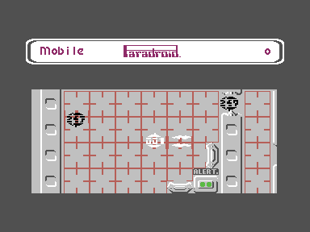

**Controls**

| | |
| --- | --- |
| Joystick in either port, or the cursor keys | drive. The droid has inertia, as in the original |
| Fire (or `Space`, `CTRL` or `C=`) with a direction | the weapon (*Weapon* in the panel): lasers in that direction, and as long as fire stays held, in whichever direction the stick goes - the droid drives while it fires, as in the original |
| Fire held, no direction | half a second's wait: a direction in it is the weapon; none, transfer mode: the player blinks, and touching a droid starts the transfer game. While fire stays held, it drives without shooting; letting go ends it |
| Fire held on a lift | after a quarter of a second, the side view of the ship: let go of fire, up and down choose a deck on that shaft, fire gets out there. Only on the lift's middle four characters, the original's `$2B`-`$2E`: as there, the character under the player counts, for 5 ticks, so driving over a lift with fire held does nothing |
| Fire held at a console | standing on the floor before it (the original's character `$42`; boxes are not consoles), the ship's computer: up and down choose a symbol, fire takes it (the first leaves); in the droid enquiry right and left turn the pages, up and down go through the droid types |
| `Run/Stop` | pause: all stands but what turns. In it: fire or `Run/Stop` go on, `Clr/Home` ends the game, `F3` freezes even that, for a photo ("Cheese"), till `Help`, `F1`/`F2` colours or black and white - no key with shift |

On a PC keyboard in an emulator: the arrow keys, and Space or either Ctrl
key as fire (Yape puts the left Ctrl on `C=` and the right one on `CTRL`).
In Yape here only the **right Ctrl** key fires: Space and the left Ctrl do
not arrive in the game, though Yape's keyboard map has them where the game
looks (row 7, bits 4 and 5, beside `CTRL` at bit 2) - not found out why
yet. The original's briefing said "Plug your joystick into port 2" and
"Control is by joystick only"; here both ports and the keys work, and the
briefing says so.

## The game

You are the 001, an influence device beamed onto a freighter whose droids
have run wild. You can shoot them, or take one over by winning the
**transfer game** against it, which makes it your host. The rules are the
original's, read from its code:

- Every droid has up to 64 energy and slowly gets it back. A shot of yours
  takes 16 per class of your host's weapon plus 80, less 4 per type of the
  droid hit. So the bare 001 cannot hurt the 8xx and 999 at all, and you
  need better hosts to get at them.
- **Armed droids fire** as the original's (`$3450`, `$34B5`): one that
  sees you, each tick, with a chance of the ship's number (1-8) in 32,
  once it is ready again - 26 ticks less its type after its last shot -
  and only while the original would have had one of its six sprites free
  (droids on the screen and their shots). Its laser leaves it where it
  is, straight at you, along the line of sight: the two distances in
  characters stretched as `$25AF` does, over 32, so 4 to 7 pixels a tick
  along the longer way. For its first four ticks it is not shown and hits
  nothing (the original's sprite is off), and it is gone where the
  original would take its sprite away (`$321E`) or at a wall. The droid
  waits 2 to 5 ticks after it fires. It takes 16 of your energy (weapon
  1: the 476, 614, 615, 751, 834, 883) or 8 (weapon 2: the 629, 821,
  999), and a droid it hits (40 less its type) times 2, as the original's
  pictures and its `$1BF6` have it.
- The **disruptor** of the 711 and 742 is a flash that hurts every droid in
  sight, and you as well, except a few types. A droid sets it off with a
  chance of the ship's number in 128 a tick, when none is flashing
  (`$34A1`).
- You only **see** a droid with nothing in between: as the original's
  `$24AE`, a line from your character to the droid's, in steps of less
  than a character, must not cross a wall character - a closed door is
  one. A droid out of sight is not shown, does not fire, and the
  disruptor does not reach it; open the door, and there it is.
- How much energy you may have **sinks** while you stay in a host: one
  point every 128 ticks in the 001, every 16 in the 999. When it reaches
  nothing, so do you. Moving on to a new host resets it. **Energizers**
  refill you up to it, at 5 points of score per point of energy. Below 8,
  the player flashes from white to black and back, with a warning sound.
- Touching a droid is a **bump**: the player is thrown back at twice its
  speed (at most its host's top speed; at 2 up and left if it stood
  still), the droid turns round and waits 16 ticks, and the stronger of
  the two hurts the weaker. It bumps once until the two are apart again.
- A lost transfer throws you out of your host, back into the bare 001,
  and takes that host's kill points off your score. Lost as the 001, it
  is the end.
- Points: 10 to 200 for a kill, 25 to 250 for a transfer, by class; 250 for
  a deck cleared, 2000 for a ship.
- Each kill raises the **alert** by the droid's type, and it sinks again
  slowly. While it is up it pays points, and the ALERT consoles turn from
  green through yellow and orange to red.

When a deck has no droids left, its lights go out. When the whole ship is
dark, the next ship of the fleet follows, with droids a class higher (its
number, which the droids fire by, stops at 8, as the original's `$67`).

**A game starts** as the original's: a page with the 001 and what it is
there for, "Game on!" in the panel, for three and a half seconds or until
fire. Then the 001 is beamed aboard, with the original's sound, at the
first waypoint of a deck between 4 and 7 - its top left; the droids start
on the waypoints after it - flashing as with low energy (it starts with
7 for that while) for 32 steps of two pictures, while the droids stand
still.

**A game ends** as the original's: the window full of static - its four
noise characters at random, black on white, going round and rolling down
the lines, with its noise - for 1.2 seconds; then the 999 with
"Transmission terminated" and its rising tune, for 4.2 seconds. A score
that is the day's top or worst then says so over it ("Great Score!",
"Lowest Score of the Day!"), and asks for initials, as the original:
three letters, each from A on; the joystick steps through A-Z and a
space (up or left back, down or right on), fire takes it.

The game runs in ticks of three pictures, as the original does: 16.7 a
second. The window scrolls a pixel at a time in any direction.

| | |
| --- | --- |
| 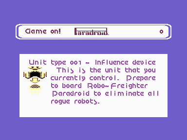 | 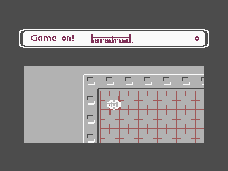 |
| **A game's start.** The original's page, with its words and the 001's picture, in its purple. | **Beamed aboard.** The 001 flashing at the top left of the deck, as in the original, before the panel says *Mobile*. |
| 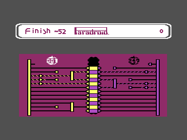 | 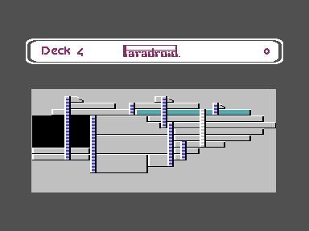 |
| **Transfer.** The original's board in its characters: yellow on the left, purple on the right, twelve lines each from the rail to the column of lights. The parts are the original's: dead ends, amplifiers that keep a pulse once they have one, colour changers, branches (one line in, two out) and gates (two in, both needed). A light shows the side whose line is live there and flickers when both are. You pick your colour (*Colour? 76*, counting down from 99 for 12 seconds), then have ten seconds (*Finish -52*, from 99 too), each a number at a time, as in the original (measured there: a step every 5.9 and 5.3 pictures). As in the original, you get your droid's class plus 3 pulses and the other side its class plus 4. The side with more lights wins; a draw is a deadlock and is played again. Winning is *Complete*; losing from a host is *Rejected* and costs that host; losing as the bare 001 is *Burnt Out*, and the game is over. | **Lift.** The original's side view of the ship: its map and characters, multicolour in white, black and blue. As in the original, the lift's own shaft is white and the deck it is at is lit, by the original's rule for which characters of the deck's box change, in the colour the deck's scheme gives those characters - mostly near its background's, cyan on the grey decks. On the cyan decks it is the background's own, and could not be seen there; here it is two levels darker. |
| 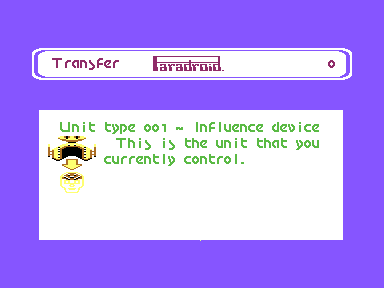 | 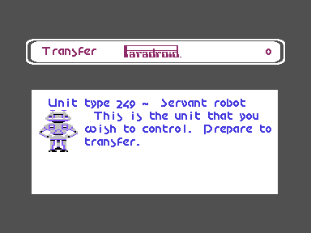 |
| **Before a transfer.** As in the original, both droids first: your own, then the one you touched, with the original's pictures and words. | The pictures are the original's, taken from it by running its own drawing routine for each droid type (see below), and kept packed in the program. |
| 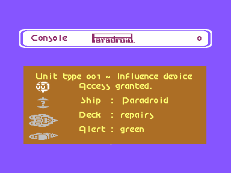 | 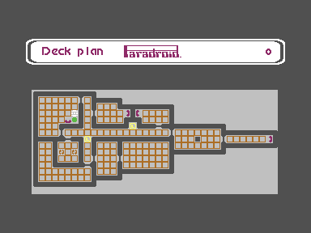 |
| **Console.** The original's first page and its four symbols: leave, droid enquiry, deck plan, ship. | **Deck plan.** As the original draws it: a character per block, the character's code being the block's number, in its characters and the deck's colours; the energizers' symbol turns and the player's blinks. |
| 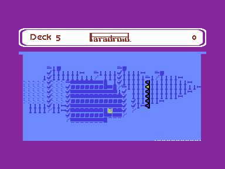 | 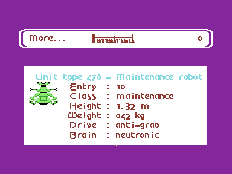 |
| **Droid enquiry.** For the types up to your host's, with the original's picture. | Its pages are the original's, read off its screens for every type (`tools/console.py`) and stored with each picture's file. |

| | |
| --- | --- |
| 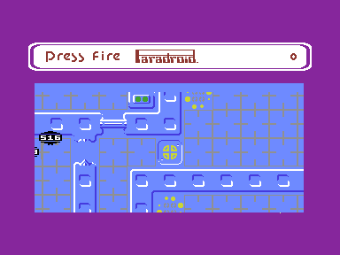 | 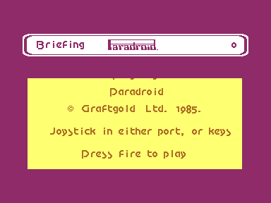 |
| **Logo.** The original's, over the whole screen: the panel's rows show the window's character set for it. As in the original, the title starts with it, and in the colours of the deck the last game ended on (its characters' colour classes in that deck's scheme, `$27E5`); the grey scheme 0 at the start. In its empty box at the bottom right, the port's credit, in the letters of the original's plates (those missing drawn in their style). | **Briefing.** The original's four pages, in the panel's letters, scrolled up a pixel at a time, each round in another of its colours: yellow, pink, light green. |
| 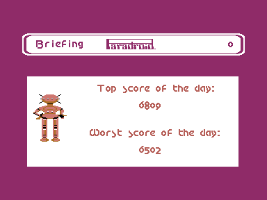 | 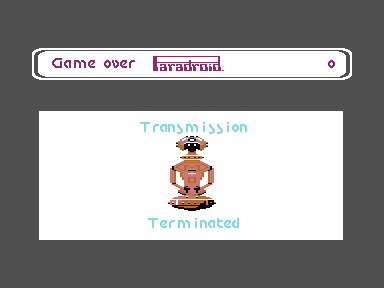 |
| **The day's scores**, the keys and the credits, on white with the original's droid, as there. The top and worst scores start as the original's, 6809 and 6502, by AEB and TSO. Then the round starts again with the logo. | **A game's end**, after the static: the 999 and the original's words. |
| 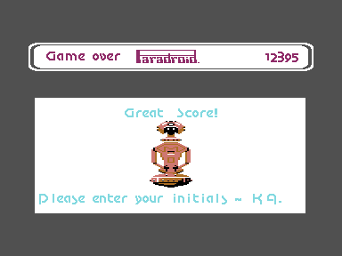 |  |
| **Initials**, for the day's top or worst score, over the end's words, as in the original: the stick steps through the letters, fire takes one. | **After a game** its score is the day's top or worst, if it is, with the initials given. |

Each of the title's screens is built with the picture off - only the
border shows, in the coming screen's colour - and switched on whole: the
logo takes some 16 pictures to build, a page about 7. So does the program's
start: from `RUN` on the picture is off and the border black - while it
unpacks itself (exomizer's own flashing turned off) and puts everything
in its place - till the logo is whole.

## As the original, measured

### Driving, walls and doors

The player drives as the original's does, read from its code in x64sc
([move.s](move.s)): the speed is a signed 8.8 number per axis; the
joystick adds 0.8125 a tick (0.8086 the other way), up to the host's top
speed by its drive; let go, it falls by 0.6875 a tick. The position moves
by the whole pixels of it, rounded up as there. So it starts with 1, 2, 3,
4, 5, 5, 6, 7 pixels a tick and rolls out with 7, 6, 5, 5, 4, 3, 3, 2, 1,
tick for tick as in the original.

Walls are characters there, not blocks: a character code from `$80` on. A
wall block is solid only in its two middle characters, a console often
only in its outermost row. Each tick, as there (`$39F9`, `$29C1`,
`$3849`): first the speed, then the walls - three points around the
player's character ((x + 7) / 8 across and down) for each way, looked at
only the way it drives (left and up also standing still); a wall there
stops it, its position set to 1 into its character driving right or
down, to the next character's start driving left or up - and only then
the move, by the speed's whole part. Driven into walls from one place on
the same deck in eight ways, the original and this stop on the same
pixel. The walls of each block are four bits per character row, kept in
the unused end of the block code tables at `$E800`.

The doors open as the original's (`$2A3E`, `$2A6D`, `$2B08`): when one of
those twelve points lies on a door's frame (the characters either side of
the door), the first tick only notes the door, and each tick after it
opens a row (or a column) more; untouched, it shuts one a tick. Driven at
a door, the player waits for it as long as in the original, to the tick.
A droid by a door opens it too; the original's droids touch it with the
points they look ahead at.

The droids choose their ways as the original's (from up to three ways of a
waypoint, each a third, or eight ticks' wait), at the original's speeds,
and like the original's they look ahead before each step: their
character and the next two. A wall there, a door not open yet, and they
wait two ticks. They do that near the player, where the doors open and
close; elsewhere the doors stay shut, and the droids go on through them.

The window follows the player across in steps of two pixels, in step with
its figure: the figures are of multicolour pixels, two wide, and the
player stands still in the middle of the window, as the original's
sprite. Measured against the original's screen (the same deck, the same
place, the energizer's dots found to the pixel), its deck stands a
character up and left of where the player's own coordinates put it: its
player's sprite is drawn a character right of and below its place, its
droids' sprites are not. So here too the window and the player's figure
are a character on, and where figures meet - bumps, shots, the droids'
aim, which the original leaves to its sprites' collisions - the player
counts where its figure is.

The figures are the original's sprites, line for line: 20 lines high
(the sprites have 21, and only the lasers' tips use the last), and where
the sprites are. A droid is the original's as `$3CFB` builds it, in one
colour: two domes with the turning gap, the number in three big digits
between them (the original's own, `$6AAE`, 7 hires pixels wide, here 3
multicolour ones), and an antenna of 2 lines, under the domes for half a
turn and above them for the other half. It is 11 multicolour pixels wide
for the original's 23 hires ones. Of its digits only the 3 is drawn
otherwise than by the rule above: its middle comes in from the right, as
the original's. The player's shot starts 12 pixels from its sprite, in
the sprites' own coordinates (`$33B5`, table `$6E58`), and none starts
where the character it would start in is a wall (`$336F`: the player's
character, plus 1 on, 2 back); a droid's starts where the droid is
(`$34B5`). So the droids, their explosions, the shots and the player all
go from the world to the screen the same way. Measured in x64sc against the original's screen
with the 001 and a 302 beside it on deck 7 (the deck found to a pixel in
both pictures), every line of both figures is where the original has
it; across, the deck itself is a pixel off, as multicolour pixels are
two wide. As the walls are the original's, to the pixel, so are the
gaps the figures keep to them.

### The decks' colours

Every deck has its own colours, as in the original: each character
belongs to one of its colour classes, and each deck has one of eight
schemes, which give the classes their colours - read from the original
([data/colours.txt](data/colours.txt)). The scheme's first colour is the
window's background, its fourth the border's and the panel frame's. A
deck whose droids are gone has the dark scheme 7, and the ALERT console's
lights take the alert's colour. On the Plus/4 the colours are the nearest
of the TED's, the deck's characters' those of 0-7, as they turn
multicolour where figures are. Where the nearest left white figures and
doors hard to see on a deck's background, it is darker (measured against
white: a contrast of about 2.5 now, 1.5 before): the light green two
levels, the cyan one, the yellow one where it is the background (not
where it draws details), and the green of the light green decks' edges
one, so that it still stands out from their background. The
console's deck plan, which shows the deck's own characters, has the
scheme too, and so has the title's logo. Those two are hires all over and
take the nearest of all the TED's colours: the window's multicolour mode,
in which a cell whose colour is one of 8-15 is drawn in multicolour, is
off for them, as for the briefing's pages.

### Characters that move

The original animates some of the deck's characters itself, and so does
this (phases and speeds read from its lists, [data/anim.txt](data/anim.txt)):
the energizer's character `$14` turns a phase every three ticks (`$2605`,
list `$6C28`); the deck plan's symbol for an energizer is that same
character, and turns there too, while the plan's player blinks, on three
phases and off for one. Every other tick the energizer's dots, its
characters `$4C`-`$4F`, go round one character on (`$38C4`). The 001 has
the original's turning dome, a slanted gap running round it: measured in
x64sc, a hires pixel a tick over eight positions; here a multicolour
pixel every two ticks over four - the same speed. So do the other droids
(`$3CFB`), with a difference: in the original each droid turns on its own,
slower the less energy it has; here all droids of a type share one
picture, shifted in advance, so they turn together, at full speed, half a
turn from the player. Their domes are the same for every type, and are
taken each step from the player's picture for that turn, with the
antenna, its colours swapped back, into the droids' pictures - only those
drawn in the window lately, and only the three columns of each shift the
gap and the antenna get into: on even ticks into a buffer and the even
ones, on odd ticks into the odd ones. The buffer is the 22 bytes after
each of the two pictures' 1000 colours and codes, which the TED does not
show. It is done after the
window is drawn, and only with a picture's time left in the tick: in a
crowded window the domes wait a tick rather than the game (measured in
Yape with eight droids of three types in the window: without it, 13 % of
the ticks came late already; turning before the drawing, 29 %).

### The transfer game

The board is the original's, character for character: its screen and
characters (`$F1`–`$FE`, `$D0`, `$D1` of the deck's set, multicolour) were
read in VICE while the original's transfer game ran. How the parts are
laid out and how a pulse passes them follows
[FreedroidClassic](https://github.com/ReinhardPrix/FreedroidClassic)
(`src/takeover.c`), whose authors rebuilt Paradroid. It has the same parts
as the original's screen and the same panel texts (*Colour? 76*,
*Finish -52*, always two digits). A side has four layers of twelve lines:
where pulses go in, two layers of parts, the connection to the column.

The work done for every line in every tick is in assembly
([xfer.s](xfer.s)): passing the pulses on, drawing a line again when it
changed, and the dashes moving along live wires, which are the two wire
characters turned by a pixel; laying the board out and the course of the
game are [transfer.s](transfer.s). Its state lives in the low memory at
`$0C68`.

### The console

The ship's computer is the original's, read from it in VICE: its first
page (unit, ship, deck, alert) beside four symbols, which are its hires
sprites; the deck's names; and for each droid type its pages (entry,
class, height, weight, drive, brain, armament, sensors, notes). The
original builds those from a dictionary of words at `$C000`; they were
read off its screens instead, by driving its joystick through every page
of every type in the monitor and decoding the screen memory. The deck plan
is drawn the way the original's code does it: each block's number is the
character code, in the original's characters `$00`-`$1F`, hires, with the
deck's blocks 3 to 41 across.

The console and the lift's side view are an overlay kept packed in the
program (see *Everything in one file*), unpacked when fire is held at a
console or on a lift. The pages about a droid are kept with its picture.

### The droids' pictures

The original draws a droid's picture from parts into eight sprites, two
side by side in four rows, with the right half often mirrored. The parts
are not stored as pictures anywhere, so [tools/pictures.py](tools/pictures.py)
works from what the original's own routine (`$3629`, type in `$58`) draws:
run in VICE's monitor once per droid type, its sprites saved each time.
The script turns them into [data/pictures.txt](data/pictures.txt), and
`mkdata.py` turns each into multicolour characters, six wide and up to
twelve high. Multicolour 1 is black, as on the C64; multicolour 2 and the
sprites' colour are set per picture. Cells with only the hires sprites'
pixels stay hires.

All 24 are kept packed in the program: their graphics in one stream, the
console's pages about them in another (6.4 KB for 15 KB; one by one they
would take 11.9 KB). For a screen that shows a droid, the graphics are
unpacked into the end of the pictures' slots, which the overlays leave
free, and the droid's copied to picture 1's character set, which the
window shows for both pictures meanwhile; the console's enquiry does the
same with the pages. The text goes there too, in the panel's letters. The words are the original's: its unit lines read
*Unit type 476 - Maintenance robot*, *robot* for classes 1-4, *droid* for
5-8, *cyborg* for 9 and *device* for the 001.

### The sound effects

The game's sounds are the original's own effects, read from its sound
driver in x64sc ([tools/sfx.py](tools/sfx.py) into
[data/sfx.txt](data/sfx.txt)): 25 of them, each a record of a start
frequency, a step added each picture and periods, at the end of each of
which the step turns round or the frequency goes back to the start. The
original plays them on two channels, as the TED has two voices. Which
event starts which effect was read off its code: the beam at a game's
start, the shot by the host's weapon (the droids' shots are silent
there), a droid hit and destroyed, the player hit and destroyed, a bump,
the energizer for each unit of energy, "Lift" and the ride from deck to
deck, the deck cleared, the transfer's "Finish", "Complete", "Rejected",
"Burnt Out" and "Deadlock", the static and "Transmission terminated"
after a game; and on their own: the ship's hum every 32 ticks while the
second voice is free, with each deck's own periods, a warning while the
energy is below 8, and transfer mode every 8 ticks.

[sfx.s](sfx.s) plays them as the original's driver does, once a picture
from the interrupt, and turns the SID's frequency into the TED's register
each picture (a division: the TED's frequency is not linear in its
register; its lowest frequency leaves ten steps of it, not 24). The TED
has no envelope: an effect sounds while its gate and half its release
would. The TED's one volume is for both voices: the ship's hum, on the
second, plays at 2 instead of 6 while the first voice is quiet - the
original's is a soft triangle, the TED's a square, and at 6 it stood out
far more than the original's. Its noise is only on the second voice, so
the noisy effects go there. Played in a 6502 emulator, the original's
driver and the model `sfx.s` follows gave the same frequencies picture
for picture for the 22 effects compared. The player runs at `$FC00`,
copied there at the start; the effects' table is in the program, the
deck's hum's periods in the free end of the block code tables.

### The title's sound

The original has no music, but its title has a sound of its own, made by
its sound driver from the game's effects (`$054A`): a counter goes down
once a picture; every 128 pictures the first voice gets one of three
falling sweeps, picked at random - from 481, 240 or 180 Hz down, a new
pitch every picture, wrapping round, a triangle, a saw and a pulse - and
twice in every 64 pictures the second voice gets the lift's ride, a low
tone wavering down and up. All at a third of the SID's volume. So it
never quite repeats.

[music.s](music.s) does the same, from the title's overlay, once a
picture from the engine's interrupt: it starts the effects and `sfx.s`
plays them as it plays the game's, at volume 3. The three sweeps are
`title1`-`title3` in `data/sfx.txt`; on the TED all three are squares, so
they differ in their pitches only. (The tune as ripped, `Paradroid.sid`,
is this driver in a 6502 emulator, [tools/sid.py](tools/sid.py): there
its random numbers - the SID's third voice, noise - never change, and it
plays the same sweep every time. The port's first title sound was that
rip, 2.56 seconds over and over.)

### The pause

As the original's (`$3B7C`, read from its code): `Run/Stop` shows
*Pause*, the sound stops, and everything stands still but the deck's
turning characters and the droids' turning domes, till fire or `Run/Stop`, which show *Continue*. In it,
as its briefing says, `Clr/Home` quits the game, straight to the title
(`$10D3`, no end of a game; here its score does not count: the picture
goes off at once, till the logo is whole), and the C64's `F7` is *Cheese*
(`$0B8A`), for a photo: not even those turn, till its `F8`, fire, `Run/Stop`
or `Clr/Home`. Not in the briefing, also as in the original (`$32B7`):
`F1` shows *Colour*, `F2` *Blk-White*, and from the pause's end on the
decks are in scheme 0, the grey one, till `F1` again (a deck without
droids keeps its dark scheme 7). The title takes `F1` and `F2` too, as
the original's loop there calls the same routine, with the word in the
panel when it shows. On the C64, `F2` and `F8` are `F1` and
`F7` with shift. The Plus/4 has keys of its own for `F1`, `F2`, `F3` and
`Help`, so here those four are the pause's, none with shift: `F1`
colours, `F2` black and white, `F3` *Cheese*, `Help` back to the pause.
The briefing's page with the keys names them so, `F1` and `F2` as well.
The keys are read once a tick, in *Cheese* too: read all the time, with
the interrupt held off while they were, the window's first line came late
and flickered.

### The data, from the original's memory

The C64 game keeps everything in memory once it has loaded. A dump of its
64 KB, taken in VICE's monitor during a game, holds it all. The addresses
were found by tracing the game:

| | |
| --- | --- |
| `$E800` | 32 blocks of 4 × 4 characters |
| `$F100` | 16 decks, run-length coded, 64 × 16 blocks each |
| `$7800` | the deck character set |
| `$0800` | each character's colour: the upper half its colour class, the lower its colour in the deck's scheme |
| `$6A44` | eight colour schemes, 12 colours each (classes 0-11; 12-15 are fixed). `$F160` gives each deck its scheme; a deck without droids has scheme 7 |
| `$C800` | waypoints per deck. The third byte has a bit for each of eight directions a droid may leave in. A game starts on the first |
| `$6CC8` | lift stops: deck and shaft. The position stored is where the *window* is when the player stands on the lift, five blocks left of and two above the lift itself |
| `$EA00` | droid types: number, drive, weapon |
| `$F180` | the side view of the ship, run-length coded. Code `c` shows as `c + $80`, from the upper half of the deck's character set |
| `$F120`–`$F15F` | each deck's box in the side view: row, column, rows, columns. Lighting a deck turns codes `$80`.. into `$90`.. and back |
| `$6CB0`–`$6CC7` | the lift shafts: column, top row, length. The shaft ridden gets colour `$F9`, white multicolour |
| `$4E40`, `$6440` | sprites: the explosion (blocks `$39`–`$43`) and the twin lasers (`$91`–`$97`), turned into multicolour figures: a run of hires pixels gets half as many multicolour ones about its middle, so the bolts stay thin, and the vertical one is smoothed and keeps its tips in 20 of its 21 lines |
| `$7F88`–`$7FF7` | the transfer game's characters `$F1`–`$FE` (and `$D0`, `$D1`): wires, arrows, the colour changer, boxes, the lights |
| `$6C28` | the animated characters: the energizer's, the plan's player; and at `$7BD0` the static's |
| `$C610` | the sound effects' records, their instruments at `$EAA0` |
| `$D000` | the briefing: per line its row and column, then the panel's codes. Capitals, `m` and `w` are two characters wide |

`tools/extract.py` writes most of it as text into [data/](data/): decks
as letters, characters as pictures. [tools/mkdata.py](tools/mkdata.py)
turns that into tables, adds the doors' half-open stages, and works out
the lift cabin's row for each deck from the shafts.

## On the Plus/4

### Fine scrolling under a fixed panel

The C64 version changes the VIC's vertical scroll register below its status
panel. In VICE, writing the TED's (`$FF06`) in the middle of the screen
does nothing: VICE reads it once per picture. Yape, whose TED is the
closer one to the real chip, does follow it there. What both follow are
two counters, and both can be written:

- `$FF1D`, the **line counter**, decides when the next row of characters is
  fetched.
- Bits 0–2 of `$FF1F`, the **row line counter**, decide which line of the
  characters is shown.

Writing only the row line counter looks like a shift if every row shows the
same characters. In fact it only **rotates** the lines within each row. That
took a test with a different character on every row to see. The two
together do move everything below, with the rows intact. At the start of the
last line of the gap under the panel, the interrupt sets:

```
$FF1D := 74 - s        ; the line counter set back by s
$FF1F := (6 - s) & 7   ; row line counter (bits 0-2) - one line later than
                       ; the obvious 7 - s, or each row's first line shows
                       ; the row above it
```

This moves the whole window down by `s` lines, `s` from 0 to 7. That is
how it was at first. On a real Plus/4 (Luca's) the window's colours
flickered while the deck scrolled up or down: green turned ochre, the border
beside the window brown. plus4emu shows the same; VICE and Yape do not. The
TED takes the PAL colour phase of each line from bit 0 of the line counter.
Set back by an odd `s`, two lines in a row have the same phase. The TV's
PAL decoder is then out of step and decodes everything with the wrong phase
until the counter jumps back under the window. So the line counter now
goes back by the even part of `s` only. The odd part goes into the vertical
scroll register, which the TED does follow in the middle of the picture
when it decides whether a row is fetched (VICE does that too, as
`rowcheck.py` shows, though it does not move the picture by it as above):

```
$FF06 := 3 + (s & 1)   ; in lines 71-73, before the counter is set back
$FF1D := 74 - (s & 6)
$FF1F := (6 - s) & 7
```

A row is fetched where the line counter and the vertical scroll agree in
their last three bits. `(line - s) & 7 = 3` is `(line - (s & 6)) & 7 = 3 +
(s & 1)`: the same lines as before. The vertical scroll must not be written
in a line whose counter matches the new value, or the row is fetched at
once. Lines 71 to 73 end in 7, 0 and 1. It goes back to 3 in the vertical
blank, at line 252. [tests/p4emu_vscroll.py](tests/p4emu_vscroll.py) checks
the colours in plus4emu, and `rowcheck.py` and `yape_rowcheck.py` check
that the rows are where they were. Below the
window, the line counter is put back to where it would have been, so the
picture ends where it always does: in line 202 it is set to 202. The TED
ends the picture's fetching only on a line that starts as 203; set
straight to 203 within the line, as it first was, that line is skipped,
the fetching goes on through the border, and the next picture starts with
the row line counter wrong, the panel already. VICE did not mind, Yape
showed garbage from the first scrolled picture on.

Setting the line counter back has one more catch: set to the line the
raster interrupt compares with, the TED raises the interrupt again at
once. For s = 3 the counter goes to 71, the very line of the interrupt
doing it; the rest of the picture's interrupts then came one late, and
the next panel was drawn on the gap's colour, a flicker every eighth line
of scrolling. So the next interrupt's line is set before the counter.
Yape does this as the chip does; VICE does not raise it.

The panel's registers for the next picture (its character set, 40
columns, its colours) are set in the vertical blank, at line 252, by an
interrupt of their own. Set right under the window, as they first were,
VICE drew a pixel of the window's colour into the border where each was
written - a dot of "snow" under the window in every picture.

The real TED does something like it too, and plus4emu with it: where one
of its colour registers (`$FF15`-`$FF19`) is written, the TED draws a
pixel of colour `$7F` - pale green - wherever that register's colour is
shown at that moment. Under the panel the gap's colour is set in its last
line; in the game nothing there shows the background, but the title's
logo covers the whole screen in grey, and on Luca's Plus/4 a dot of snow
danced at its top left. The colour is only written now when it changes
(`tests/p4emu_snow.py`: no such pixel in 1500 pictures of the title).

`tests/rowcheck.py` checks the result for all eight positions in VICE,
`tests/yape_rowcheck.py` in Yape. For each one they compare every line of
the window on the screen with the characters in memory.

Moving rows down leaves lines between the gap and the first row moved:
the TED shows the row before again there, its last lines. At first that
was the gap's last row, blank, and the first row was cut with copies whose
top lines were cleared - so the window's top eight lines never showed
anything, while the original's text and deck go right up to its edge.

Now the window's rows start in the gap's last row (screen row 8), and that
row is what shows twice: first in the gap, then its last s+1 lines at the
window's top, as the original's are cut there. In the gap it must not
show. Its cells get copies of their characters in codes of their own
(picture 0's in 216-235, picture 1's in 236-255), and the gap is shown in
the other picture's character set, where those codes are blank; at the
window's top the set switches to the window's own, together with the
window's colour. Both are written in the line the counters are set back
in, after its visible part. That line is the one place where it can be
timed: the counters are set at `$FF1E` 106 to 122 there, always, after
the colour was written in the line before (as it once was), and the TED
never stops the processor in that line, whatever s is - it decided that
at the line's start, before the counters changed. Written at `$FF1E` 136
on, the colour and set show from the next line's start. A first try put
the colour's change a line later, after the moved rows had begun: there,
for s = 0 and 7, the TED stops the processor to fetch a row through the
whole visible part, and the colour came a line or two late in one picture
in five to twenty. Measured in Yape with `tests/yape_top.py`, which needs
the briefing rolling to show it; `tests/yape_gamegap.py` checks the game,
`tests/yape_gap.py` the title. What row 8 shows at the window's top is
checked in memory: `tests/yape_toprow.py`, driving about, compares it in
the picture on show with the deck. (It was missing at first: picture 1's
last copy code ends at 256, 0 in a byte, so it got none, and the window's
top lines were blank in every other picture - a flicker.)

Row 8 is the window's now in everything drawn into it: pages clear it,
its colours too (they show at the window's top; left from the logo, the
briefing's first lines came in the logo's greys). The logo, over the
whole screen in one character set, has the gap rows in that set too:
`_gap_eor` (engine.s) is 0 for it, `eng_plain()` puts it back.

The figures lose the 40 codes to the copies: they have 75 (the most seen
in a crowd of droids). In the title, where both pictures show picture 1's
set, the gap's is picture 0's, cleared from POOL on for it.

The gap is the rows 6 and 7 and row 8's first showing; the window is 128
lines high, as the original's, a line lower under the panel than there. The
interrupt stops twice in the gap: at its first line for the gap's
character set and modes, and at line 71 for the scroll, so that it does
not wait through the gap. The gap's cells are blank in the deck's
characters but not in the panel's: switched a few lines into the gap, as
it was, the switch came late now and then, and a short dashed line of the
panel's characters showed in the gap (`tests/yape_gap.py` finds it).

The briefing scrolls the same way, up a pixel a tick, as the original's
(measured in x64sc: 16.7 pixels a second), and two while the joystick is
held down, as there. For that, its file brings a character set of its
own: the 109 different characters of the panel's letters it uses, put
into picture 1's character set. Between rows only the top row is made
again, the fine scroll moves the rest. Each step is made as soon as the
last one shows and handed to the interrupt in the picture before its
turn, so it shows exactly every third picture; a new row of characters is
made in assembly ([briefrows.s](briefrows.s)) in under a picture.
`tests/yape_brief.py` measures how far the page moves in each picture.

### Figures over a hires deck

The decks are hires characters, as on the C64: each cell has a background
and one colour of its own, and walls and floors are drawn with single-pixel
lines. A droid on top of them would turn every line in its cells the
droid's colour. So the cells a figure covers switch to **multicolour**. On
the TED that is a bit in each cell's colour, while the rest of the window
stays hires. The deck character in such a cell is turned into multicolour
too (any pixel pair with something set becomes the cell's own colour). That
makes floor lines one pixel thicker inside the droid's cells and leaves
them their colour. The droids use the two colours all multicolour cells
share: black for the others, white for the player, as the original's
sprites.

### Pictures shifted in advance

A figure can start at four multicolour pixels inside a cell. Shifting its
20 lines at drawing time cost more than everything else in a picture put
together, as the sampling profiler (`tests/profile.py`) showed. So each
picture is shifted once into a 512-byte slot when it is needed: for the
droid types on a deck when you enter it, and for the player's droid when you
change host. A slot holds all four positions, the columns one under the
other with blank lines between them, and for each column which lines have
pixels. Drawing is then copying through a mask, and only into cells with
something in them: which rows of cells those are follows from the
column's lines and the line the figure starts at inside its cell, by two
small tables, not by shifting. The pictures themselves are 3 bytes a
line, 12 multicolour pixels, all any figure needs.

A droid standing on a waypoint (a multiple of 8 down) starts 5 lines into
a cell, as the original's sprite does there, and so takes four rows of
cells, its antenna's line alone in the last; the earlier 16-line figure
fit two rows there. That costs about a third more cells for the droids
in the window.

### Where the time goes

`tests/chprof.py` counts the cycles of every instruction of the last few
pictures from VICE's CPU history, per routine: unlike sampling through the
monitor, which stops the machine at moments of its own and so over- or
under-counts whole routines, that is exact. With a deck full of droids and
the fire button held, drawing the window takes about half of the time,
the game itself about a seventh, and a good third is left over; while the
window scrolls, building its new rows takes the most.

Everything done for each droid or door every tick is in assembly: the
droids' choices at their waypoints and their steps
([engine.s](engine.s)), looking ahead, the walls, the doors, a droid
touching the player and the block under a point ([move.s](move.s)), and
putting the droids, their explosions and the shots into the window
([figs.s](figs.s)). A droid looks ahead only when it has entered a new
character or turned, not every tick. The doors look only at the droids
that can be by a door on the screen, two to four usually, not at all of
them.

### Memory

The program, its tables, 23 slots of pre-shifted pictures and what it
keeps packed fill the Plus/4 up to `$C000`. Above that sit two pictures
with their character sets, the panel's character set, the block tables,
and at `$F000` the engine's tables and the code of the figures, the window
and the panel. The data and code used only once at the start - the
panel's first drawing, the engine's tables, the character sets' first
copies, the code and tables that are copied elsewhere - are linked into
the very bytes where the slots begin, so they are overwritten as soon as
they have done their work (`INITCODE` comes right after the data: the
slots start at the data's first byte).

Small corners are used too: the unpacker at `$0200`-`$03FF` (only the
KERNAL's loading needed that), the sight's line ([sight.s](sight.s)) at
`$0100`-`$01BF` under the processor's stack (which never went below
`$01D8`, measured through the game, its pages, the console and
transfers), a few words and `player_spot()` after the sound effects'
player up to `$FCEF` (cc65's stack above it used 2 bytes), two small
routines after the engine's lists at `$0FEB`-`$0FFC`, and tables that
are only read once a game runs in the free ends of the block colour table
(from entry 160 on in each of its four rows: 40 blocks use 0-159) and at
`$FF40`, above the TED's registers.

## Everything in one file

The game is `build/paradroid.prg`, 45 KB packed by exomizer into 32 KB
(129 blocks). With the KERNAL that loads in about 85 seconds from a 1541
and 45 from a 1551 (from the speeds measured for the files before), far
less with JiffyDOS, SD2IEC or a cartridge's fast loading; then it unpacks
itself into place in a few seconds. Nothing loads after that, so it runs
from anything that can load a program, and emulators start it directly.

Inside it, [exomizer](https://bitbucket.org/magli143/exomizer) keeps
packed what is not needed all the time:

- **Overlays**, code and data linked to run in the 23 pictures' slots
  (11.8 KB): the title with the briefing, the scores page and the logo
  ([title.s](title.s), 9.8 KB, packed 5.6 KB); the console with the lift's
  side view ([screens.s](screens.s), 4 KB, packed 2.5 KB); the transfer
  game ([transfer.s](transfer.s) and xfer.s's board, 3.5 KB, packed
  2.3 KB). Each is unpacked when it is wanted; afterwards the slots are
  made again (the explosions' and lasers' first, then the player's and
  the deck's droid types).
- **The droids' pictures**, in two streams (above), unpacked into the end
  of the slots, after the overlay that shows them.
- **The decks' maps** (3.5 KB, packed 1.7 KB), all unpacked into the
  droid types' slots when a deck is entered, which are made for the deck
  right after.
- **The explosion's and lasers' pictures**, unpacked into the last two
  slots before they are shifted into theirs.

[unpack.s](unpack.s) unpacks with exomizer's own unpacker,
[exodecrunch.s](exodecrunch.s) (changed only where it says so), at
`$0200`. [build.sh](build.sh) links twice: the overlays are packed from
the first link and put at the program's end (`BLOBS`), and the second
link must give the same overlays - nothing they refer to moves.

To make the room, the game is all assembly: it began in C, and the C was
rewritten module by module, each checked against the C it replaced with
the traces of [tests/](tests/) - the same random start and keys in both,
the droids, shots, score, doors, panel and slots compared after every
tick (the C's `rnd() % 12` in the transfer game took the X register too,
whatever it held; here it is the random byte's, as meant).

Until 2026-10-04 the title and the pictures were files on the disk, with
fast loaders for the 1551 and the 1541 of its own. On a real 1541-II the
loader failed, and SD2IEC and Joco's C264 SD drive could not load the
files at all: one file loaded by the KERNAL avoids all of that.

## What is not 1:1

- In the **transfer game**, how the parts are laid out and how long a
  pulse lasts follow FreedroidClassic (see above), not the original's
  code. Its look, the pulse counts and how the other side plays are the
  original's.
- The droids are **13 multicolour pixels wide** with their number in a dark
  band. The original's hires sprites are 24 pixels wide, and the Plus/4's
  characters have half the horizontal resolution.
- The TED has no sprites: a cell a figure is in turns multicolour, and the
  **deck under a figure** with it, a hires pixel pair with anything set
  becoming a whole multicolour pixel. Around a droid, lines a pixel wide
  (a door's, a console's) are two wide; in the original the deck shows
  through its sprite's gaps as it is.
- The player's **colour** is the TED's second multicolour colour, which
  the droids' numbers have too: when the player flashes (low energy, a
  game's start), so do they. For the same reason the player keeps its
  white in transfer mode, where the original's turns dark grey.
- The droids look ahead, and so open **doors**, only near the player; in
  the original they do so all over the deck. A droid near a door opens it
  here rather than touching its frame.
- The deck's colour starts a line above the window's top edge (see
  above); in the original, the edge and the colour change are the same.
- **Colours**: the nearest of the TED's, the light ones some darker as
  backgrounds (see above); some, like the red and the light green, look a little
  different from the C64's.
- **Sound**: the effects and the title's sound are the original's, but on
  the TED's squares instead of the SID's triangles, saws and pulses, and
  without its envelopes; the TED's noise and lowest notes are higher than
  the SID's.
- The droids' **pictures** (console, transfer, the start page, the end)
  start two lines lower than the original's: the heading's letters are two
  rows tall, and the original's picture, a sprite over them, starts in
  their lower row. Characters cannot share a cell that way.
- Between the start page and the deck, the window is empty for about
  four pictures, while the deck is drawn the first time.
- After a console, a lift or a transfer the game stands still for about a
  second while the pictures' slots are made again (the overlay was
  unpacked into them). The lift's side view stays up meanwhile, in its
  colours; the new deck's border and panel frame come with its first
  picture.
- The player's **explosion** at a game's end is ours, shorter than the
  original's several explosions around it.
- The **briefing**'s "C64 remote terminal" is a "Plus4 remote terminal"
  here, and its keys for the pause's *Cheese* are `F3` and `Help` for the
  C64's `F7` and `F8` (see above); it names `F1` and `F2` too.
- The droids' **pictures** in the original's yellow (the 001, the 999)
  are a level darker, on the white pages, as the yellow decks are - both
  their colours, the cells' and the second multicolour, the same yellow
  as in the original.
- The **border** of a deck without droids, the dark scheme 7's yellow, is
  a level darker too (`$67`), so that it does not glare.
- In the **lift's side view**, the lit deck on the cyan decks (13, 14):
  the original's is the background's own cyan there; here it is two
  levels darker, so that it can be seen.
- In the **title**, the original also takes `F5`/`F6` (the volume, 0-15,
  shown in the panel); here there is no volume. `F1`/`F2` it takes, as
  there.

## Files

| | |
| --- | --- |
| [paradroid.s](paradroid.s) | start, the main loop, the overlays unpacked, pause, a game's end |
| [deck.s](deck.s) | the ship, entering a deck and finding its doors, lifts and consoles by the player |
| [droids.s](droids.s) | the player, the droids, shots, hits, bumps, energy |
| [draw.s](draw.s) | the window, the player's figure, the pictures shifted in advance, the status panel; run at `$F300` |
| [picture.s](picture.s) | the droids' pictures and the panel's letters in the window: for the transfer, the console, the start and the end |
| [transfer.s](transfer.s), [xfer.s](xfer.s) | the transfer game, an overlay: its course and board, and what is done for every line every tick (xfer.s: the letters and pictures always there) |
| [screens.s](screens.s) | the ship's computer and riding a lift, an overlay: menu, droid enquiry, deck plan, side view |
| [title.s](title.s), [briefrows.s](briefrows.s), [music.s](music.s) | the title, an overlay: logo, briefing and scores, the briefing's rows, its sound; a game's start page |
| [sfx.s](sfx.s), [sfxcall.s](sfxcall.s) | the original's sound effects: the player at `$FC00`, starting them, the beam-in |
| [unpack.s](unpack.s), [exodecrunch.s](exodecrunch.s) | unpacking what is kept packed (exomizer's unpacker) |
| [sight.s](sight.s) | which droids the player sees: the original's line of sight, past walls and closed doors |
| [move.s](move.s) | the player's driving, the walls, the doors, the droids looking ahead, bumps, the decks' colours |
| [figs.s](figs.s) | the droids, their explosions and the shots into the window, run at `$F300` |
| [engine.s](engine.s) | raster interrupt and fine scroll, the two pictures, building the window, figures, the droids' ways, keyboard, the animated characters |
| [startup.s](startup.s) | the start, once: everything into its place |
| [game.inc](game.inc) | what the parts share: the keys, droids and shots, the pictures' slots, where things are in memory (the numbers from the data are in `build/gen/data.inc`, by `mkdata.py`) |
| [paradroid.cfg](paradroid.cfg) | the memory layout |
| [build.sh](build.sh), [run.sh](run.sh), [run-yape.sh](run-yape.sh) | building the program; starting VICE or Yape with it |
| [tools/extract.py](tools/extract.py) | the original's data out of a memory dump |
| [tools/pictures.py](tools/pictures.py) | the droids' pictures, the console's symbols and the title's logo out of the original |
| [tools/console.py](tools/console.py) | the console's pages about the droids, as read off the original's screens |
| [tools/mkdata.py](tools/mkdata.py) | `data/` into `build/gen/`: the tables, the briefing into the title's data, the decks, pictures and fixed figures packed |
| [tools/sfx.py](tools/sfx.py) | the original's sound effects out of a memory dump |
| [tools/sid.py](tools/sid.py) | a PSID's player run in a 6502 emulator, what it writes to the SID recorded: how the original's sound driver was looked at |
| [tools/yape.patch](tools/yape.patch) | Yape's changes for the gamepad and the tests |
| [data/](data/) | decks, blocks, characters, colours, animated characters, waypoints, lifts, droids, panel, side view, briefing, transfer characters, droid pictures, console, logo, sound, as text |
| [tests/](tests/) | headless VICE and Yape: screenshots, traces against an older build, speed, profile, edges and rows, stress, the title and a game's start |

## Building and running

From the repository root, with any of its files active, `F5` builds and
starts it: the root's run script hands the build to [build.sh](build.sh)
and the start to [run.sh](run.sh). Without an editor:

```sh
sh paradroid/build.sh
xplus4 -autostart paradroid/build/paradroid.prg
```

The build needs [exomizer](https://bitbucket.org/magli143/exomizer) 3.1
besides cc65's assembler and linker (`$EXOMIZER`, else beside cc65's
tools): it packs what the game keeps packed, and the program as a whole.

`build/paradroid.prg` is all there is: emulators start it directly, and
on a Plus/4 it runs from any drive, SD card adapter or cartridge
(`LOAD "PARADROID",8` and `RUN`; copied onto a disk for a 1541 or 1551).

A third emulator is **plus4emu**, whose TED shows what the other two do not
(the colours above): [run-plus4emu.sh](run-plus4emu.sh), or
`sh paradroid/run-plus4emu.sh` without an editor. The script says how to
set it up. The repository's README has it too.

The second F5 configuration, "... in Yape", starts it in **Yape** instead
([run-yape.sh](run-yape.sh); `sh paradroid/run-yape.sh` without an
editor). Yape gets the program with its full path (it looks for a
relative one in its own folder), and the gamepad set up: Yape takes a game
controller's right stick and A as the joystick, so for the Xbox One S
controller over Bluetooth the script hides the Steam Deck's own
controller from SDL, hands SDL a mapping that gives the left stick as the
right one too, and sets Yape's "active joy for keyset" to NONE, which puts
a single controller on both joystick ports. It takes a Yape built with
[tools/yape.patch](tools/yape.patch) if there is one (the script says how
to build it): Yape took one of SDL's events a frame, and a gamepad's
stream of axis events left the stick seconds behind; with all of them a
frame the stick arrives in about 30 ms (`tests/yape_joylag.py` measures
that against SDL itself, with someone moving the stick). The patched Yape
also leaves the controller's other buttons alone (`YAPE_PADKEYS=off`):
Yape's own B steps the active joystick on (BOTH leaves it on none), LB
types RUN, RB opens its menu. The patch also has the tests' hooks.

`tools/extract.py` is only needed to take the data out of the original
again: `python3 tools/extract.py ram.bin io.bin`, with the two dumps made in
VICE's monitor (`bank ram`, `save "ram.bin" 0 0000 ffff`, and `bank io`,
`save "io.bin" 0 d000 dfff`) during a game. Likewise `tools/sfx.py` makes
`data/sfx.txt` again from the same memory dump
(`python3 tools/sfx.py ram.bin`).

## Tests

Everything in [tests/](tests/) runs VICE without a window, through its
monitor on a port of its own:

| | |
| --- | --- |
| `stress.py [s]` | random joystick for a while; fails if the game stops ticking |
| `speed.py keys s` | ticks per second while keys are held (16.7 is full speed) |
| `profile.py keys` | where the time goes, by symbol, sampled (rough) |
| `chprof.py keys` | where the time goes, by symbol, every cycle of the last pictures |
| `trace.py root out [ticks] [seed] [arena\|disrupt]` | a game tick by tick, of the build in `root`: the same random start and keys each time, the droids, shots, score, doors, panel, slots after every tick; `tracecmp.py a b` compares two |
| `xtrace.py root out [seed]` | the transfer game step by step: parts, pulses, the board as drawn |
| `contrace.py root out` | the console's pages and a lift ride: what the window shows |
| `rowcheck.py` | every line of the window on screen against memory, for all eight fine positions |
| `edges.py` | the window's top edge for every fine position |
| `screens.py` | the screenshots in this README (but `start.png` and `beam.png`: `yape_start.py`'s pictures 60 and 158); the transfer it plays is won at its end (the leader set where the original looks at it), so that the game goes on to its end pictures |

All of them start the program. Only one test runs at a time:
each first ends any other still running ([tests/onetest.py](tests/onetest.py)),
and `build.sh` does not build under one.

The `yape_*.py` tests run **Yape** the same way, as its TED is closer to
the real one than VICE's: a build of Yape from its sources
([yapesdl](https://github.com/calmopyrin/yapesdl)) in
`~/.cache/paradroid/yapesdl` with [tools/yape.patch](tools/yape.patch):
SIGUSR1 enters its monitor, which reads its commands from stdin, and
SIGUSR2 saves the TED's picture ([tests/yape.py](tests/yape.py)). The
tests run Yape without its speed limit.

| | |
| --- | --- |
| `yape_boot.py [s] [warp]` | the start: registers and a screenshot every five seconds |
| `yape_play.py [s] [seed]` | the title, fire, a random joystick; fails if the game stops ticking |
| `yape_rowcheck.py` | `rowcheck.py` in Yape, with the window's top line |
| `yape_top.py [n]` | the window's top line in Yape while the briefing rolls, for each fine position (`YTOP_FILL=1`: line by line) |
| `yape_gamegap.py [n]` | in a game in Yape, driving: the gap clean and the window's top in place in every picture |
| `yape_toprow.py [n]` | in a game in Yape, driving: the window's top row in memory against the deck, in the picture on show |
| `yape_still.py [n]` | in a game standing still, n pictures: each one's content fitted to the first's |
| `yape_rollcheck.py [n]` | the briefing rolling in Yape: its rows against where they are meant to be |
| `yape_xfer.py [n]` | transfers in Yape |
| `yape_brief.py [n]` | the briefing in Yape, n pictures in a row: how far it moves in each |
| `yape_title.py` | the title's scores page in Yape, with its picture |
| `yape_start.py [logo]` | a game's start in Yape (fire on the briefing, or on the logo), 400 pictures in a row: the start page, the beam, "Mobile" |
| `yape_panel.py [n] [title\|down]` | the status panel in Yape, n pictures in a row: the ones it differs in (a flicker) |
| `yape_gap.py [n]` | the gap between panel and window in Yape, n pictures in a row: anything in it |
| `yape_snow.py [n] [label ...]` | the window's bottom edge in Yape, n pictures in a row: stray pixels there (with labels, those routines switched off) |
| `yape_cheese.py [n]` | the pause's *Cheese* in Yape (patched in, Yape cannot press `F3`): n pictures, all must be the first |
| `yape_joylag.py [s]` | how late the gamepad's stick arrives in Yape, against SDL itself (move the stick when READY shows) |

The `p4emu*.py` tests run **plus4emu** inside the test, through its library
([tests/p4emu.py](tests/p4emu.py)): no window, no process of its own, the
TED's pictures straight from its video output. The release's own
`libplus4emu.so` lacks functions, so the library is built from plus4emu's
sources (`~/.cache/plus4emu/buildlib.sh`, see `p4emu.py`).

| | |
| --- | --- |
| `p4emu_vscroll.py [n]` | in a game in plus4emu, driving up and down: the border beside the window and the window's colour in every picture, by fine position (the PAL phase) |
| `p4emu_snow.py [n]` | the title in plus4emu, n pictures: pixels of colour `$7F`, which the TED draws where a colour register is written |
| `p4emu_pause.py [keys]` | the pause's keys pressed on plus4emu's keyboard (VICE and Yape cannot): `Run/Stop`, `F1`, `F2`, `F3`, `Help`, `Clr/Home`; a picture after each |
| `p4emu_lift.py` | where on a lift's block fire held starts it, and a ride to another deck (let go, a stop down, fire) picture by picture: the border must change with the window |
| `p4emu_tmode.py` | transfer mode: fire held with a direction drives and does not shoot |
| `p4emu_sight.py` | the line of sight on deck 4: a droid in the room seen, behind a wall or a closed door not, through the opened door again |
| `p4emu_fire.py` | fire's states as the original's: the wait, transfer mode, the weapon (also from a direction in the wait, and kept with fire held), letting go |
| `p4emu_xcount.py` | the transfer game's counts, picture by picture: every number from 99 down, and how often |
| `yape_pads.py` | the gamepads Yape sees, in its order (which one is on which joystick port) |
