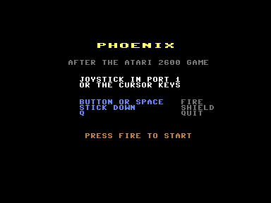
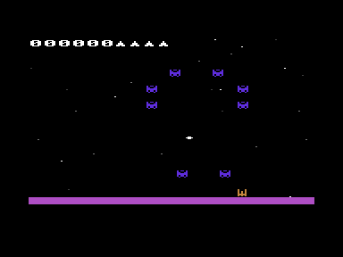
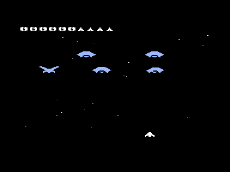
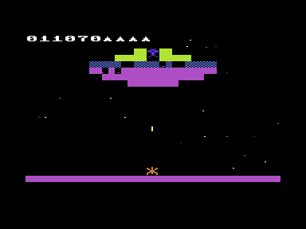
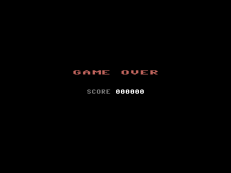

# Phoenix for the Commodore Plus/4

A rebuild of **Phoenix** as the Atari 2600 played it (Atari, 1982; the arcade
original is Amstar/Centuri, 1980). All five waves, the force field, the
mothership, two-voice sound with the arcade melodies, and a starfield that
scrolls a pixel at a time.



**Controls**

| | |
| --- | --- |
| Joystick in port 1 | left/right to move, button to fire, **pull towards you** for the force field |
| Keyboard | cursor left/right, `Space` to fire, cursor down for the force field |
| `Q` or `Run/Stop` | quit |

## The five waves

| | | |
| --- | --- | --- |
| 1 | small birds, orange | a swaying formation; one drops out at a time, dives at the ship and drops an egg on the way |
| 2 | small birds, green | the same, but the button auto-repeats while it is held — the only wave that does |
| 3 | large birds, blue | shooting a wing takes it off; only a hit in the middle kills. Wings grow back |
| 4 | large birds, red | the same, faster |
| 5 | the mothership | it comes down the screen while the hull has to be chewed away from below |

After the fifth wave the round starts again, a little quicker each time.






**Scoring**, as on the 2600: a small bird is worth 20 sitting in the formation
and 80 in flight; a large one 100 to 500 depending on how far down it has come
when you hit it, and 20 for a wing. The mothership is worth 1000 to 4000 in
the first round and another 1000 per round after that, up to 9000 — the lower
you let it come, the more. Five ships, one extra at 5000 points.

The force field burns for a second and a half, cannot be raised again for
another three and a half, and roots the ship to the spot while it is up. The
ship may still fire, and anything that touches the field dies.

## How it is built

The 2600 shows 160 pixels across, the Plus/4 shows 320 — so one 2600 pixel
becomes two, and the 2600 playfield of 160×192 lands exactly on 40×24
character cells. Everything in the game is stored at 2600 resolution and
doubled in width when it is drawn. That mapping is the reason the result looks
like the original rather than like a Plus/4 game.

Three things carry the whole thing:

**The starfield scrolls in software, and that is the interesting part.**
It did not start that way. The TED has a fine scroll register (`$FF06` bits
0–2) that moves the whole picture a pixel at a time for nothing, and a whole
screen of stars came along for free. Everything that had to stand still — the
score, the ship, the birds — was simply drawn a pixel higher for every pixel
the scroll had moved, which for the figures costs nothing because they are
placed at a free vertical offset anyway.

It looked right in screenshots and wrong in motion. The register moves the
entire screen in the instant it is written; a figure only follows on its next
redraw, and a redraw takes a whole pass — four frames. So every step left the
figures a pixel behind until they were drawn again, and when the register
wrapped from seven back to zero, **everything on screen jumped seven pixels up
and then crawled back down one figure at a time**. Once a second, across the
whole picture.

There is no way to synchronise that while drawing takes longer than a frame:
either everything on screen is hardware-scrolled or nothing is. So the
register now stays where it is and the stars carry themselves — they are
sparse, one character each, and moving them costs a fraction of what the
compensation cost. The scrolling looks exactly the same, a pixel per pass,
because that is what it was doing before.

It also handed back the score strip. That only had to be rewritten on every
single pass because the scroll was moving underneath it; standing still, it is
touched when the score changes and not otherwise. Between the two, the game
went from seven frames per pass to four.

**Figures are finished blocks of characters, not computed ones.** The Plus/4
has no sprites, so a figure is characters that are rewritten as it moves. A
figure can stand at four horizontal and eight vertical positions inside its
cells, so there are 32 ways it can look — and all 32 are worked out when a
wave starts. Drawing is then a copy of 48 bytes into the character set plus a
handful of screen codes. Computing the cells per frame instead cost about
4000 cycles per figure, and a frame has 17784.

**The mothership is background, not a figure.** It is far too large to redraw,
so its cells live in the shadow copy of the screen and it comes down a whole
character row at a time, slowly. Figures flying over it put it back when they
move on. A shot takes a bite out of the lowest
piece of hull in its column; once a column is chewed through, the shot still
has to pass the rim, which turns and closes the gap again.

The result is about twelve passes a second with a full flock on screen, more
as it empties. Every speed and every length of time in the game is counted in
those passes rather than in frames, which is why [phoenix.c](phoenix.c) has a
`TAKT` constant and no magic number for the shield's second and a half.

Getting there took measuring rather than guessing. Of one pass, the figures
cost about half, and of that the arithmetic around the drawing — working out
which cells a figure lands on and handing back the ones it has left — cost
more than the drawing itself, so that part is assembly too. What C does here
it does honestly but expensively: parameters live on a software stack and are
read back through a zero page pointer on every use, and `sy + 8 - yfein` on
three bytes is a call to a sixteen bit addition routine.

## What is not 1:1

- **One colour per character cell.** A 2600 bird is two-toned; here a bird is
  one colour. Everything else about the palette follows the manual — violet
  and orange, violet and green, blue, red.
- **Eight small birds and six large ones** per wave, not the arcade's twenty.
  The 2600 shows far fewer than the arcade too, but not exactly these numbers.
- **The artwork is drawn by hand** from the original's proportions, not
  extracted from the 2600 ROM. The shapes read right; they are not identical.
- **Nine to fifteen steps a second** rather than sixty. Speeds are scaled so
  the ship crosses the screen and the birds dive at about the original pace;
  the movement is coarser, not slower.

## Reading the keyboard

Worth knowing before touching the input code: the row goes to **both** latches,
`$FD30` and `$FF08`, and `$FF08` then has to be read **twice**. The write
leaves its own value on the data bus and the TED samples the keyboard lines a
cycle later, so a read in the instruction right after the write hands back what
was just written — which looks exactly like the key on that row's own line
being held down. With row `$7F` that is Run/Stop, and the game quit the moment
it started.

A test program easily misses this: as soon as a few instructions happen to sit
between the write and the read, array indexing is enough, the answer is right.
It has to be measured in the real program.

The matrix itself was read out of the KERNAL's own table at `$E026` rather than
taken from documentation; its scan routine sits at `$DB70` and is the best
source for both.

## Testing

Two switches at the top of [phoenix.c](phoenix.c) exist so the game can be
watched running in an emulator with nobody at the joystick:

- `autopilot` — steers, fires and raises the field on its own, and walks
  straight through the title screen.
- `unsterblich` — nothing can kill the ship.

A real round never sets either. They are there because a game that dies
immediately without input is very hard to measure: an early measurement of the
frame rate was pure nonsense because the run had long since ended and the
machine was sitting in BASIC.

## Building and running

From the repository root, with `phoenix.c` active in the editor, `F5` builds
and starts it. Without an editor:

```sh
BIN=~/.local/share/cc65-vs64/bin
mkdir -p phoenix/build
$BIN/cl65 -t plus4 -O -Cl -g -c -o phoenix/build/phoenix.o phoenix/phoenix.c
$BIN/cl65 -t plus4       -o phoenix/build/phoenix.prg phoenix/build/phoenix.o
$BIN/xplus4 -autostartprgmode 1 phoenix/build/phoenix.prg
```

`-Cl` matters: cc65 otherwise keeps local variables on its software stack, and
that costs a sixth of the running time in a game that is busy every frame.
The switch lives in [cflags](cflags), which the build script picks up.
