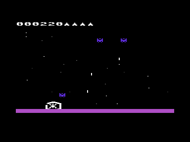
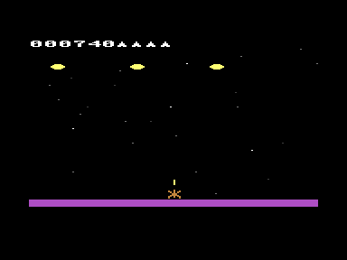

# Phoenix for the Commodore Plus/4

A rebuild of **Phoenix** as the Atari 2600 played it (Atari, 1982; the arcade
original is Amstar/Centuri, 1980). All five waves, the force field, the
mothership, two-voice sound with the arcade melodies, and a starfield that
scrolls a pixel at a time.

How the birds fly, how fast the ship moves, what the ship and its force
field look like and what the first wave is made of are **measured off the
ROM itself**, frame by frame, rather than read about —
[Measuring the original](#measuring-the-original) says how.


**Controls**

| | |
| --- | --- |
| Joystick in port 1 | left/right to move, button to fire, **pull towards you** for the force field |
| Keyboard | cursor left/right, `Space` to fire, cursor down for the force field |
| `Q` or `Run/Stop` | quit |

## The five waves

| | | |
| --- | --- | --- |
| 1 | small birds, violet | a drifting ring of eight; two drop out at a time and swoop past the ship, and the whole flock shoots |
| 2 | small birds, green | the same, but the button auto-repeats while it is held — the only wave that does |
| 3 | large birds, blue | they arrive as eggs floating down in a zigzag and hatch on the way; shooting a wing takes it off, only a hit in the middle kills, and the wings grow back |
| 4 | large birds, red | the same, with less quiet between attacks |
| 5 | the mothership | it comes down the screen while the hull has to be chewed away from below |

After the fifth wave the round starts again. What gets harder from round to
round is not how fast the birds fly — that never changes — but how soon the
next pair leaves and how hard the flock shoots.






**Scoring**, as on the 2600: a small bird is worth 20 sitting in the formation
and 80 in flight; a large one 100 to 500 depending on how far down it has come
when you hit it, and 20 for a wing. The mothership is worth 1000 to 4000 in
the first round and another 1000 per round after that, up to 9000 — the lower
you let it come, the more. Five ships, one extra at 5000 points.

The force field burns for a second and a half, cannot be raised again for
another three and a half, and roots the ship to the spot while it is up. The
ship may still fire, and anything that touches the field dies.

## How the flock moves

Everything in this section is **measured off the original**, not read about.
The ROM runs in Stella, the debugger stops it after every single frame and
saves a picture, and the birds are read out of those pictures. See
[Measuring the original](#measuring-the-original) for how that is done.

The PAL machine draws fifty frames a second and its playfield is as tall as
ours, so a scanline there is a pixel here and the numbers carry over as they
are:

| | measured on the 2600 | in pixels a second |
| --- | --- | --- |
| flock drifting sideways | 1 pixel per 3 frames | 17 |
| a bird swooping, down and up | 4 pixels per 3 frames | 67 |
| what the birds drop | 8 pixels per 3 frames | 133 |
| the ship | 1 pixel per frame | 50 |
| the ship's shot | 8 pixels per frame | 400 |

And the shape of an attack:

- the flock sits in a **ring** — eight birds at four heights eighteen pixels
  apart, two to a height, the outer pair fifty-one pixels apart and the inner
  pairs twenty-four;
- it **drifts sideways** and turns round when its outer birds reach the edge.
  It **does not descend**. Sitting still is safe from the ring itself;
- **exactly two birds** leave, off the bottom of the ring, and they leave
  together;
- the swoop is **dead steady** — four pixels every three frames, no gathering
  speed — and it **does not aim**. The pair swings sideways on a slow rhythm
  of its own whatever the ship does;
- thirteen pixels above the ship they **level out**, run along the bottom for
  about a second, then **climb back at the same rate** and take their places
  again;
- only a second after they are home do the **next two** leave. A whole attack
  takes about four seconds, a second of which is quiet.

That is a far quieter attack than it sounds like, and it is the point: in the
first wave **the birds never come near the ship at all**. What kills you is
what they drop, roughly one shot every quarter of a second from wherever a
bird happens to be, falling twice as fast as a bird flies.

Two earlier attempts got this wrong in the same direction. The first sent one
bird at a time down a straight line that re-aimed twelve times a second. The
second sent up to four at once on zig-zags that drifted towards the ship, over
a flock that crept down the screen as it was thinned out — both of them
relentless next to the console, and neither of them Phoenix. Anything that
homes in on the player is wrong here.

### Time is kept by the clock, not by the loop

A pass through the game loop takes as long as the drawing takes, and the
drawing gets cheaper as the flock is shot away — so a game counted in passes
quietly speeds up towards the end of a wave. Everything above is therefore
counted off the KERNAL's clock at `$A5`, which the machine ticks sixty times
a second whatever we are drawing, and each speed is carried as thirty-seconds
of a pixel per tick with the remainder kept between passes. The motion is
coarser than the original's, because we redraw some twenty times a second and
not fifty; it is not faster or slower.

## How it is built

The 2600 shows 160 pixels across, the Plus/4 shows 320 — so one 2600 pixel
becomes two, and the 2600 playfield of 160×192 lands exactly on 40×24
character cells. Everything in the game is stored at 2600 resolution and
doubled in width when it is drawn. That mapping is the reason the result looks
like the original rather than like a Plus/4 game.

Three things carry the whole thing:

**The starfield scrolls in software, and that is the interesting part.**
It did not start that way. The TED has a fine scroll register (`$FF06` bits
0–2) that moves the whole picture a pixel at a time for nothing, and a whole
screen of stars came along for free. Everything that had to stand still — the
score, the ship, the birds — was simply drawn a pixel higher for every pixel
the scroll had moved, which for the figures costs nothing because they are
placed at a free vertical offset anyway.

It looked right in screenshots and wrong in motion. The register moves the
entire screen in the instant it is written; a figure only follows on its next
redraw, and a redraw takes a whole pass — four frames. So every step left the
figures a pixel behind until they were drawn again, and when the register
wrapped from seven back to zero, **everything on screen jumped seven pixels up
and then crawled back down one figure at a time**. Once a second, across the
whole picture.

There is no way to synchronise that while drawing takes longer than a frame:
either everything on screen is hardware-scrolled or nothing is. So the
register now stays where it is and the stars carry themselves — they are
sparse, one character each, and moving them costs a fraction of what the
compensation cost. The scrolling looks exactly the same, a pixel per pass,
because that is what it was doing before.

It also handed back the score strip. That only had to be rewritten on every
single pass because the scroll was moving underneath it; standing still, it is
touched when the score changes and not otherwise. Between the two, the game
went from seven frames per pass to four.

**Figures are finished blocks of characters, not computed ones.** The Plus/4
has no sprites, so a figure is characters that are rewritten as it moves. A
figure can stand at four horizontal and eight vertical positions inside its
cells, so there are 32 ways it can look — and all 32 are worked out when a
wave starts. Drawing is then a copy of 48 bytes into the character set plus a
handful of screen codes. Computing the cells per frame instead cost about
4000 cycles per figure, and a frame has 17784.

**Two figures can share a cell.** A cell shows one character, so when a shot
crossed a bird the shot's cell simply replaced the bird's and an eight by
eight block of the bird went missing for as long as it took to fly past. A
figure now looks at what is already standing in a cell before it takes it: if
that is another figure's character, it ORs its own pixels into that character
instead of claiming the cell. Nothing has to be undone afterwards, because
every figure copies its block over its own characters again on the next pass.
The cell keeps the colour of whoever got there first, which is the whole
price. The same test guards handing a cell back: a figure only restores the
background where its own character is still standing, so it cannot wipe out
somebody who moved in over it.

That is good enough for something small and fast crossing something large -
a shot over a bird - and not good enough for two large figures that sit on
each other for a while. Whoever draws second borrows the first one's cell,
and as soon as the first one moves off that cell it hands it back to the
background with both of them in it, which blinks. So the two cases where it
would have mattered are arranged not to arise: **birds do not step onto each
other** - the sideways step gives way, which is what the original's pair does
anyway - and **the ship and its force field are one shape**, not two drawn
over each other.

**The mothership is background, not a figure.** It is eighty 2600 pixels
across and forty-one tall - twenty character cells by five and a bit - which
is far too large to redraw, so its cells live in the shadow copy of the screen
and it comes down a whole character row at a time. Figures flying over it put
it back when they move on. Its shape is traced off the original too: two banks
of blocks climbing outwards from a notch at the top with the alien sitting in
it, a band across the full width, and a hull below that tapers away. A shot takes a bite out of the lowest
piece of hull in its column; once a column is chewed through, the shot still
has to pass the rim, which turns and closes the gap again.

The result is about twenty passes a second with a full flock on screen, and
more as it empties - which is exactly why nothing is counted in passes any
more. See [Time is kept by the clock](#time-is-kept-by-the-clock-not-by-the-loop).

The score used to be a hitch of its own: pulling six digits out of a 32 bit
number means six calls to cc65's long division, fifteen thousand cycles, most
of a frame - every time a bird died. The digits *are* the score now, added one
at a time with a carry, and only the digit that changed is redrawn.

Getting there took measuring rather than guessing. Of one pass, the figures
cost about half, and of that the arithmetic around the drawing — working out
which cells a figure lands on and handing back the ones it has left — cost
more than the drawing itself, so that part is assembly too. What C does here
it does honestly but expensively: parameters live on a software stack and are
read back through a zero page pointer on every use, and `sy + 8 - yfein` on
three bytes is a call to a sixteen bit addition routine.

Two results from that measuring were the opposite of what they should have
been. Keeping the ten digits ready-doubled in a table is a third *slower* than
doubling them again on every change — cc65 reaches an absolute array with one
instruction, while the same byte through a pointer costs an index calculation.
And eight rounds of two bytes beat sixteen rounds of one, because an iteration
costs more than the work inside it. Neither is visible in the source; both
took a run with the load held constant, because the autopilot otherwise
wanders into different situations at different speeds and the noise is larger
than the effect.

## Where the shapes come from

The ships, the birds, the mothership, the alien and the ground band are
**traced off pictures of the original, pixel by pixel**, not drawn by eye.
The screenshots used for the shapes are four image pixels wide and two tall
per 2600 pixel; the pictures Stella saves with `-ss1x 1` are two wide and one
tall. Either way a sprite can be read out exactly, and a small script turns
the resulting bitmaps into the tables in [phoenix.c](phoenix.c). The comment
beside each table is the shape it holds, so a wrong bit is visible in the
source.

The ship and its force field are read out of a running original the same
way, frame by frame: the ship is seven 2600 pixels across and ten tall, and
the field an arch sixteen across and fifteen tall that stands around it,
open at the bottom. The ship drawn here before that was off a still picture
and had its pods in the wrong place.

Both kinds of shot are thin vertical stripes, one 2600 pixel wide - the
ship's six scanlines tall, what the birds drop five. They were a round blob
here for a while, which is both wrong and worse: a wide shape covers more
character cells, and every cell it covers is one the bird underneath has to
share.

That was worth doing. The first set was drawn from the proportions in
descriptions and looked like a different game - the small bird is six 2600
pixels across with its wings in and eight with them out, the large one sixteen
across and ten tall with the body in the middle four, and none of that is
guessable.

## What is not 1:1

- **The ground band is a stripe, not a field.** On the 2600 it takes up the
  bottom fifth of the screen; here it is one character row. Our screen is two
  hundred lines to the PAL machine's two hundred and seventy-four, and the
  playfield was kept at its full height instead, so the band had to give.
- **The ship glows white while its field is up.** On the 2600 the arch is
  white and the ship inside it keeps its orange. The two are only fifteen
  pixels tall together, so they share both of their character rows here, and
  a cell holds one colour - they are drawn as one shape and it is white.
- **Remaining ships sit beside the score**, not under it as on the 2600.
- **One colour per character cell.** A 2600 bird is two-toned; here a bird is
  one colour, the dominant of the two. Wave one's three colours are picked
  off a running original and matched against the Plus/4 palette; the later
  waves' are still taken off still pictures, which is not the same thing,
  because a 2600 cycles its colours while it sits in its demo.
- **Eight small birds and six large ones** per wave, not the arcade's twenty.
  The 2600 shows far fewer than the arcade too, but not exactly these numbers.
- **Waves three, four and five** have the measured speeds and the measured
  shape of an attack, but their own formations and the egg-hatching are still
  reconstructed rather than measured - only the first two waves have been
  read off the ROM frame by frame so far.
- **The explosions and every sound** are still invented. A sound cannot be
  read off a picture at all.
- **The field stands still** where the console blinks it on every other
  frame. At fifty frames a second that reads as a shimmer; at our twenty the
  same trick would be a ten hertz blink.
- **Some twenty steps a second** rather than fifty. Every speed is the
  original's to within a couple of per cent, but it is delivered in bigger
  steps: the machine cannot redraw a dozen figures built out of characters
  fifty times a second.

## Reading the keyboard

Worth knowing before touching the input code: the row goes to **both** latches,
`$FD30` and `$FF08`, and `$FF08` then has to be read **twice**. The write
leaves its own value on the data bus and the TED samples the keyboard lines a
cycle later, so a read in the instruction right after the write hands back what
was just written — which looks exactly like the key on that row's own line
being held down. With row `$7F` that is Run/Stop, and the game quit the moment
it started.

A test program easily misses this: as soon as a few instructions happen to sit
between the write and the read, array indexing is enough, the answer is right.
It has to be measured in the real program.

The matrix itself was read out of the KERNAL's own table at `$E026` rather than
taken from documentation; its scan routine sits at `$DB70` and is the best
source for both.

## Measuring the original

The ROM itself is the reference for everything above. How to get numbers out
of it, on a machine where the emulator must not take the screen or the
keyboard away from whoever is using it:

**Run Stella where it cannot be seen.** It has no headless mode and the SDL
dummy drivers crash it, but a nested compositor works:

```sh
gamescope --backend headless -W 1920 -H 1200 -- \
    stella -debug -ss1x 1 -sssingle 0 -snapsavedir <dir> "<rom>.a26"
```

No window appears, nothing takes focus. `-ss1x 1` makes every snapshot a raw
TIA picture — 320x274 for PAL, two image pixels per 2600 pixel across and one
scanline per row down — so positions can be read out of it exactly.

**Drive it from a script.** Stella runs `~/.config/stella/autoexec.script`
whenever the debugger is entered, and that script can do the whole job:

```
loadState 0
frame 1
saveSnap
... 300 times ...
quit
```

`frame` advances by exactly one frame, `saveSnap` writes a PNG, `dump` writes
memory, the CPU and the input registers to a file. Three hundred frames take
about five minutes, and out of them comes every number in the table above.

**Getting a real game to start** is the awkward part. Fire does not do it —
the Game Reset switch does, and `-holdreset` holds it down for ever, so the
game freezes at its first frame. There is no debugger command for the
console switches, and with no input device inside the compositor nothing ever
releases them. The way through:

1. run once with `-holdreset`, `frame 40`, `saveState 0`, `quit`;
2. run again without it, `frame 40`, `saveState 1`, `quit`;
3. the two state files differ in one byte that is `$3E` in the first and
   `$3F` in the second — the last byte of the file, which is `SWCHB`. Bit 0
   is the Reset switch, `0` meaning pressed;
4. patch that byte to `$3F` and load the state. The game runs.

The debugger's `joy0Right` and friends do **not** reach the game — `SWCHA`
stays `$FF` — so the ship's own speed cannot be measured that way. It comes
out of the demo the console plays to itself instead, which is the game
playing with its own hands.

**The same trick on our side.** The Plus/4 emulator runs headless in the same
compositor with its binary monitor on a port of its own, and the game is
built with `autopilot` and `unsterblich` set so it plays itself. Memory is
read straight out of it — `cl65 -g` plus `ld65 --dbgfile` gives the address
of every static — and the screen is fetched through the monitor's display
command, so our birds can be measured exactly the way the original's were.

## Testing

Two switches at the top of [phoenix.c](phoenix.c) exist so the game can be
watched running in an emulator with nobody at the joystick:

- `autopilot` — steers, fires and raises the field on its own, and walks
  straight through the title screen.
- `unsterblich` — nothing can kill the ship.

A real round never sets either. They are there because a game that dies
immediately without input is very hard to measure: an early measurement of the
frame rate was pure nonsense because the run had long since ended and the
machine was sitting in BASIC.

The pictures in this file come from the same setup. A script watches the
game's own variables through the monitor and takes the shot when the state is
the one it wants - all eight birds in the ring, three eggs still falling, the
saucer far enough down - which is a good deal more reliable than pressing a
key at the right moment.

## Building and running

From the repository root, with `phoenix.c` active in the editor, `F5` builds
and starts it. Without an editor:

```sh
BIN=~/.local/share/cc65-vs64/bin
mkdir -p phoenix/build
$BIN/cl65 -t plus4 -O -Cl -g -c -o phoenix/build/phoenix.o phoenix/phoenix.c
$BIN/cl65 -t plus4       -o phoenix/build/phoenix.prg phoenix/build/phoenix.o
$BIN/xplus4 -autostartprgmode 1 phoenix/build/phoenix.prg
```

`-Cl` matters: cc65 otherwise keeps local variables on its software stack, and
that costs a sixth of the running time in a game that is busy every frame.
The switch lives in [cflags](cflags), which the build script picks up.
