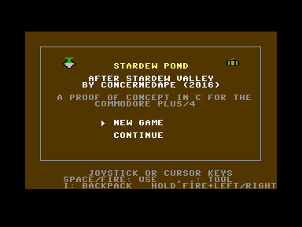
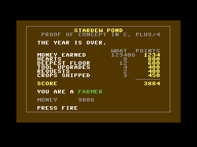
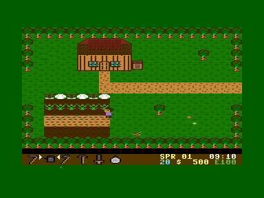
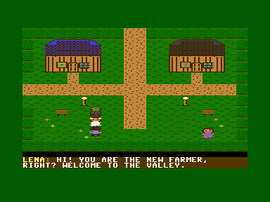
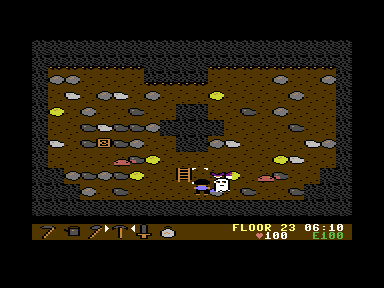
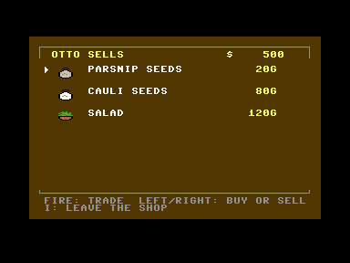
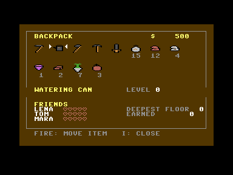

# Stardew Pond for the Commodore Plus/4

A small farming game for the Plus/4: a farm that has gone to seed, a
village with a store and a blacksmith, three villagers to make friends
with, and a mine with thirty floors of rock, ore and monsters, over one
year.

## After Stardew Valley

Stardew Pond is modelled on **[Stardew Valley](https://www.stardewvalley.net/)**
by Eric Barone (ConcernedApe), released in 2016. The idea of the game and
most of what there is to do in it come from there: taking over a neglected
farm, crops that belong to a season and have to be watered every day, the
shipping bin that pays overnight, the village store and the blacksmith who
upgrades tools, villagers whose friendship grows with talk and presents,
and a mine whose floors give copper, then iron, then gold. Even the name
points at it - a pond is a small valley with water in it.

It is a fan-made proof of concept - how much of such a game plain C gets
onto a 1984 home computer - and not affiliated with or endorsed by
ConcernedApe. It is a much smaller game than Stardew Valley, and nothing of
it is taken from there: no code, no graphics, no music, no text. The
graphics are drawn for the Plus/4, the villagers and their lines are new,
and the music is Erik Satie's (public domain) and a tune of its own. If you
like this, play the real one.



## The game

You start with 500 gold, five tools and fifteen parsnip seeds, in the
farmhouse on the morning of the first day of spring.

- **The farm.** Hoe the grass, plant, and water every day: a crop only
  grows on days it was watered or it rained. Ripe crops come out with a
  press of the button, whatever is in your hand. What goes into the
  shipping bin next to the house is paid for overnight. The field fills up
  with weeds, stones and branches over time; the sword, the pickaxe and the
  axe clear them.
- **Seasons.** 14 days each. Every season has its own crops, and whatever
  is still in the ground when the season ends withers. Nothing grows in
  winter. The grass changes colour with the season, and the evening makes
  everything darker.
- **The village.** Otto's store sells the season's seeds and a salad, and
  buys everything. Karl the smith smelts five ores into a bar and turns
  three bars into a better tool: copper, iron, gold. A better hoe or
  watering can works on more tiles at once, a better axe and pickaxe need
  fewer blows, a better sword hits harder. He also makes sprinklers, which
  water the four tiles around them every morning.
- **The villagers.** Lena, Tom and Mara are out in the village between nine
  and seven, and at home in the upper village until ten: Lena in the house
  on the left, Tom and Mara in the one on the right. After that they are
  asleep and the doors stay shut until morning. Talk to them every day, and give them presents: each has a favourite,
  something they like and something they would rather not have. The notice
  board in the upper village has a new request every week.
- **The mine.** North of the village. Copper from the first floor, iron from
  the tenth, gold from the twentieth, and now and then an amethyst. The
  ladder down is under one of the rocks. Slimes hop at you, bats flutter,
  and further down ghosts drift through the rock. The lift at the entrance
  goes to every fifth floor you have reached.
- **Energy and time.** Every tool costs energy; food gives it back. A day
  runs from six in the morning to two at night, about ten minutes. Going to
  bed ends it and saves the game. Staying up until two, or being knocked out
  in the mine, costs a tenth of your money.
- **One year.** The game is one year, 56 days, about nine hours. The night
  after the last day of winter the year is reckoned up:

  | | points |
  | --- | --- |
  | money earned over the year | 1 per 10 gold |
  | friendship | 100 per heart (5 per villager) |
  | the deepest floor of the mine | 50 per floor |
  | tool upgrades | 100 per level |
  | requests from the notice board | 200 each |
  | kinds of crop sold | 150 each |

  The page names the game, so a photo of it is proof of the score, and
  gives a rank from *greenhorn* to *legend of the valley*. Then it is back to
  the title. The save file is still the last morning: *continue* plays the
  last day again.







**Controls**

| | |
| --- | --- |
| Joystick in either port, or the cursor keys | walk |
| Fire, `Space` or `Return` | use what is in your hand on the tile in front of you (marked by the white corners); talk; harvest; open a door or a shop |
| `,` `.` | previous / next item in the toolbar |
| Hold fire and push left or right | previous / next item, with the joystick alone |
| `I` | the backpack: all 16 slots, moving items around, friendships. `I` or `Esc` also leaves every menu |

In the toolbar, the number left of the money is how many of the selected
item you carry, or how full the watering can is. `E` is your energy; in the
mine the heart shows your health instead of the money.




## What is new compared with the other games here

The [Phoenix clone](../phoenix/README.md) and the
[Demon Attack clone](../demonattack/README.md) are one screen and one
program. This game is a world, and that brings three problems of its own:
it does not fit in memory at once, the figures walk over a background that
is different everywhere, and it has to remember the farm between sessions.

### Rooms from the disk

The game runs from a `.d64`. The program is 31 KB; everything else is a
file of its own on the disk and is loaded when it is needed:

| File | | |
| --- | --- | --- |
| `hud` | 2 KB | the toolbar's character set: icons, frames, hearts |
| `tiles0`..`tiles2` | 0.5–2 KB | tile sets: outside, inside, mine |
| `room00`..`room13` | 250 bytes | one room each: 20 × 11 tiles, colours, exits, doors |

A room is one screen of 20 × 11 tiles. A tile is 2 × 2 multicolour
characters, 8 × 16 pixels, and walking off the edge of a room or through a
door loads the room behind it. The three mine floors are cave shapes on the
disk; the rocks, ores and monsters are put in when you climb down.

Loading goes through the KERNAL, which on the Plus/4 needs the ROM switched
in. With the ROM in, the processor takes its interrupts from the ROM's
vectors, not the game's, so for the time of a load the TED's interrupt is
switched off and the screen with it: the picture goes dark while a room
comes in. Everything the game shows is set up again afterwards.

The first versions of the files were too slow on a real 1541 — a tile set
took six seconds, and going in and out of the farmhouse loads one each
time. So the files hold only what is used: a tile set is only the
characters it has and a table as long as its tiles, a room fits in a single
disk block. And a tile set, once loaded, stays in memory. Rooms still come
off the disk every time.

### Figures that are see-through

In Demon Attack the background behind the figures is black, so a figure is
simply ORed into its characters. Here it walks over grass, soil, crops,
floorboards and rock. So every figure has a mask: its `%00` pixels are
see-through, and that is also where the mask comes from — each shifted byte
of the figure gives its own mask through one table lookup, because a pixel
that is `%00` in the figure is a pixel that shows what is behind it.

The rest is the Demon Attack engine, rebuilt for this:

- two pictures, one shown, one being drawn, swapped by the raster interrupt
  once a picture is complete;
- characters 176–255 are handed out afresh for every picture; a figure's
  cell gets one with a copy of the map character in it, and the figure goes
  in through its mask;
- the next picture drawn into the same buffer puts back what was there.
  What goes back is not remembered per cell but read from a **map image**,
  the screen as it would be without any figures. When the farmer hoes a
  tile, the tile changes in the map image and in both pictures at once, and
  nothing that is put back later can bring the grass back.

A character cell has one colour of its own (for its `%11` pixels) and three
it shares with the whole screen. A figure only takes the colour cell where
it has `%11` pixels on that cell's lines; everywhere else the tile keeps
its colour. Where it does take it, whatever of the tile was `%11` in that
cell would change colour with it — soil turning the colour of the
farmer's shirt. So those pixels are turned into the dark shared colour
while the figure is there, which reads as a shadow.

That only works if the ground the figures walk on uses little `%11`. So
the soil is drawn in the shared colours: dry soil light brown with dark
furrows, wet soil dark brown, and the colour cell is left for a few clumps,
the plants and the fruit. The farmer's shirt is his `%11`, skin and hair
are the two shared colours. The cursor on the tile in front of him uses no
`%11` at all.

### A toolbar with a character set of its own

The map uses 176 characters of its tile set and hands out the other 80 to
the figures. There is no room for letters and icons as well. So the toolbar
has a character set of its own, and the raster interrupt switches to it
halfway down the screen, together with the toolbar's colours.

A register written in the middle of a line changes the rest of that line,
and hitting the gap between two lines exactly is not possible from an
interrupt. So the switch happens inside a row that looks the same before
and after: row 22 is one character code in a black colour cell, all its
pixels `%11`, and that code is solid `%11` in both character sets. Whenever
the writes land, the row stays black.

Menus — the store, the smith, the backpack, the title — show the toolbar's
character set on the whole screen.

### A save file

Going to bed saves the game. Everything that has to survive a session is
one structure: the date, money, the backpack, tool levels, friendships, and
the two farm rooms with what grows where. It lives at `$0800`, where the
Plus/4's own text screen would be. That place is chosen: the KERNAL saves
with the ROM switched in, and anything above `$8000` it would read from the
ROM instead of the RAM beneath.

### Music

The farm, the village and the houses play the opening of Erik Satie's
*Gymnopédie No. 1* (1888): slow and quiet, the left hand's bass and chord
broken into three notes. The mine has a darker tune of its own, in A minor.
Both are text in [data/music.txt](data/music.txt), a note and a length per
entry, and the data tool turns them into tables.

The raster interrupt plays them, once per picture, not the main loop: the
tempo does not change with how much there is to draw. A sound effect borrows
only voice 2, the accompaniment, for its few frames: the tune on voice 1
plays on, and the accompaniment comes back the moment the effect is over,
with the note it would be playing by then.

### Keys that are not lost

The interrupt also reads the keyboard and the joysticks once per picture
and notes every key that goes down. The game collects those notes when it
gets round to it. Before, it read the keys itself, and a short tap while it
was busy - drawing a menu takes a moment in C - was simply never seen.

### Where the time goes

Measured in VICE, pictures per second (the screen shows 50):

| | |
| --- | --- |
| farmhouse, farm, village, standing or walking | 50 |
| mine, floor 3: one monster | 25 |
| mine, floor 13: three monsters | 25 |
| mine, floor 23: four monsters | 16–19 (the floors are random) |

A figure costs roughly 4,500 cycles, about a quarter of what a picture
leaves the program. Movement counts in frames, not in pictures, so the game
runs at the same speed however many there are; fewer pictures only make
the steps larger.

What made it faster, found with a sampling profiler over VICE's monitor:

- the game logic runs while the finished picture is waiting to be shown,
  not after;
- the masks come from the shifted figure instead of being shifted
  themselves;
- which cells of a figure have pixels, and which have `%11` ones, is
  gathered once per character row instead of once per line;
- the check whether the farmer's feet are on something solid no longer
  calls anything and never leaves 8 bits.

### Graphics as text

All pictures are text files in [data/](data/), one character per pixel:

```
tile TREE col=green1 flags=solid
..xxxx..
.x#.##x.
x##.###x
...
```

`.` is the background (grass, floor), `x` the dark colour, `o` the light
brown, `#` the colour of the character cell. [tools/mkdata.py](tools/mkdata.py)
turns them into the files on the disk, shares identical characters between
tiles, and checks that a tile set stays within its 176 characters. With
`--preview` it also draws every tile set, room, icon and figure into PNG
files, to look at without an emulator. The rooms are text as well, in
[data/rooms.txt](data/rooms.txt), a character per tile.

## Files

| | |
| --- | --- |
| [stardew.c](stardew.c) | the farmer, input, time, the day, and the main loop |
| [world.c](world.c) | rooms and tile sets from the disk, the map image, the save file |
| [farm.c](farm.c) | hoeing, watering, planting, harvesting, and the night |
| [ui.c](ui.c) | toolbar, conversations, store, smith, lift, notice board, backpack, title |
| [town.c](town.c) | the villagers |
| [mine.c](mine.c) | floors, rocks, ores, monsters, the sword |
| [engine.s](engine.s) | raster interrupt, the two pictures, figures, keyboard and joysticks |
| [game.h](game.h) | what the parts share |
| [stardew.cfg](stardew.cfg) | the memory layout |
| [data/](data/) | tiles, icons, figures and rooms as text |
| [tools/mkdata.py](tools/mkdata.py) | makes the disk files and `build/gen/` from `data/` |
| [build.sh](build.sh) | builds `build/stardew.prg` and `build/stardew.d64` |
| [tests/run_tests.py](tests/run_tests.py) | plays the game in a headless VICE and checks it (see below) |
| [tests/vice.py](tests/vice.py) | starts VICE without a window and talks to its monitor |
| [run.sh](run.sh) | starts VICE with the disk |

## Building and running

From the repository root, with any of the `.c` files active, `F5` builds
and starts it: the root's run script hands the build to
[build.sh](build.sh) and the start to [run.sh](run.sh), which boots the
disk. Without an editor:

```sh
./build.sh
~/.local/share/cc65-vs64/bin/xplus4 -autostart build/stardew.d64
```

`build.sh` needs Python 3 for the data and `c1541` from VICE for the disk
(inside the Flatpak sandbox it is taken from the host). It looks for cc65
in `~/.local/share/cc65-vs64/bin`, or in `CC65_BIN`.

## Tests

```sh
./build.sh
tests/run_tests.py            # all of them, about two minutes
tests/run_tests.py sleep      # the ones with "sleep" in their name
tests/run_tests.py -l         # the list
```

The tests play the game the way a player would - keys go in through a byte
the game reads as if they were pressed (`dbg_keys`) - but they set up what
they need directly: the time, the backpack, the tiles of the farm, and they
jump into rooms (`dbg_goto`) instead of walking there. They cover farming
and the night, shipping, the store and the smith, upgraded tools,
sprinklers, the change of season, presents, the villagers' houses, the
notice board, the mine and its lift, fainting, passing out at two, music,
and a saved game coming back. VICE runs inside a headless gamescope, so no
window appears. A failed test leaves a screenshot in `build/test/`.

The game saves to the disk it runs from. Rebuilding makes a new disk and
with it an empty save.
